# T-SQL Terminal Project (`TsqlTerminal`)

Process analysis and architecture diagrams for the C# and SQL project in `TsqlTerminal`, generated with **CodeFlow**.

### Generation Command
```bash
codeflow.exe analyze --source C:\Users\U00001\source\repos\TsqlTerminal --recursive --format mermaid,excel,json,svg -n tsql_terminal --diagram-type all --output-dir ./docs/csharp --no-truncate --ignore-tests
```

---

## Table of Contents
1. [Flowchart (Top-to-Bottom TD)](#1-flowchart-top-to-bottom-td)
2. [Flowchart (Left-to-Right LR)](#2-flowchart-left-to-right-lr)
3. [User & Data Journey](#3-user--data-journey)
4. [Sequence Diagram](#4-sequence-diagram)
5. [State Diagram](#5-state-diagram)
6. [Entity-Relationship (ER) Diagram](#6-entity-relationship-er-diagram)
7. [Artifacts Summary](#7-artifacts-summary)

---

## 1. Flowchart (Top-to-Bottom TD)
Vertical architecture view showing the C# entry points, SQL execution helpers, and the SQL scripts they invoke.

- **SVG:** [tsql_terminal.svg](tsql_terminal.svg)
- **Mermaid Source:** [tsql_terminal.mmd](tsql_terminal.mmd)

### SVG Visualization
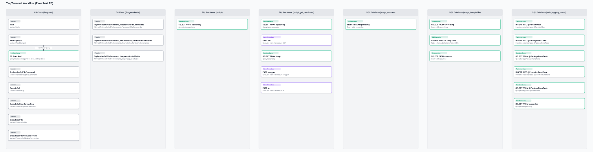

### Mermaid Diagram
```mermaid
%%{init: {"theme": "base", "themeVariables": {"fontFamily": "-apple-system, BlinkMacSystemFont, Segoe UI, Roboto, sans-serif", "fontSize": "13px", "primaryColor": "#FFFFFF", "primaryBorderColor": "#CBD5E1", "primaryTextColor": "#0F172A", "secondaryColor": "#F8FAFC", "tertiaryColor": "#F1F5F9", "lineColor": "#64748B", "textColor": "#0F172A", "mainBkg": "#FFFFFF", "nodeBorder": "#CBD5E1", "clusterBkg": "#F8FAFC", "clusterBorder": "#E2E8F0", "titleColor": "#0F172A", "edgeLabelBackground": "#FFFFFF"}, "maxTextSize": 1000000}}%%
flowchart TD
    classDef default fill:#FFFFFF,stroke:#CBD5E1,stroke-width:1.5px,color:#0F172A,rx:6px,ry:6px;
    classDef defaultNode fill:#FFFFFF,stroke:#CBD5E1,stroke-width:1.5px,color:#0F172A,rx:6px,ry:6px;
    classDef dbNode fill:#FFFFFF,stroke:#10B981,stroke-width:2px,color:#065F46,rx:6px,ry:6px;
    classDef apiNode fill:#FFFFFF,stroke:#3B82F6,stroke-width:2px,color:#1E40AF,rx:6px,ry:6px;
    classDef scriptNode fill:#FFFFFF,stroke:#6366F1,stroke-width:2px,color:#3730A3,rx:6px,ry:6px;
    classDef procNode fill:#FFFFFF,stroke:#8B5CF6,stroke-width:2px,color:#5B21B6,rx:6px,ry:6px;
    classDef taskNode fill:#FFFFFF,stroke:#F59E0B,stroke-width:2px,color:#92400E,rx:6px,ry:6px;
    classDef assertNode fill:#FFFFFF,stroke:#EC4899,stroke-width:2px,color:#9D174D,rx:6px,ry:6px;
    subgraph lane_cs_Program ["C# Class (Program)"]
        s1["<b>Main</b><br/><small>Function</small><br/><sub>Method Main</sub>"]:::defaultNode
        s2["<b>ReadSqlInput</b><br/><small>Function</small><br/><sub>Method ReadSqlInput</sub>"]:::defaultNode
        s3[("<b>EF: lines.Add</b><br/><small>SQL Query</small><br/><sub>Entity Framework Operation lines.Add(nextLine)</sub>")]:::dbNode
        s4["<b>TryResolveSqlFileCommand</b><br/><small>Function</small><br/><sub>Method TryResolveSqlFileCommand</sub>"]:::defaultNode
        s5["<b>ExecuteSql</b><br/><small>Function</small><br/><sub>Method ExecuteSql</sub>"]:::defaultNode
        s6["<b>ExecuteSqlNewConnection</b><br/><small>Function</small><br/><sub>Method ExecuteSqlNewConnection</sub>"]:::defaultNode
        s7["<b>ExecuteSqlFile</b><br/><small>Function</small><br/><sub>Method ExecuteSqlFile</sub>"]:::defaultNode
        s8["<b>ExecuteSqlFileNewConnection</b><br/><small>Function</small><br/><sub>Method ExecuteSqlFileNewConnection</sub>"]:::defaultNode
    end

    subgraph lane_cs_ProgramTests ["C# Class (ProgramTests)"]
        s9["<b>TryResolveSqlFileCommand_ParsesValidFileCommands</b><br/><small>Function</small><br/><sub>Method TryResolveSqlFileCommand_ParsesValidFileCommands</sub>"]:::defaultNode
        s10["<b>TryResolveSqlFileCommand_ReturnsFalse_ForNonFileCommands</b><br/><small>Function</small><br/><sub>Method TryResolveSqlFileCommand_ReturnsFalse_ForNonFileCommands</sub>"]:::defaultNode
        s11["<b>TryResolveSqlFileCommand_UnquotesQuotedPaths</b><br/><small>Function</small><br/><sub>Method TryResolveSqlFileCommand_UnquotesQuotedPaths</sub>"]:::defaultNode
    end

    subgraph lane_sql_script ["SQL Database (script)"]
        s12[("<b>SELECT FROM sysssislog</b><br/><small>SQL Query</small><br/><sub>Query table sysssislog</sub>")]:::dbNode
    end

    subgraph lane_sql_script_get_resultsets ["SQL Database (script_get_resultsets)"]
        s13[("<b>SELECT FROM sysssislog</b><br/><small>SQL Query</small><br/><sub>Query table sysssislog</sub>")]:::dbNode
        s14["<b>EXEC SET</b><br/><small>Stored Procedure</small><br/><sub>Executes stored procedure SET</sub>"]:::procNode
        s15[("<b>SELECT FROM temp</b><br/><small>SQL Query</small><br/><sub>Query table temp</sub>")]:::dbNode
        s16["<b>EXEC wrapper</b><br/><small>Stored Procedure</small><br/><sub>Executes stored procedure wrapper</sub>"]:::procNode
        s17["<b>EXEC in</b><br/><small>Stored Procedure</small><br/><sub>Executes stored procedure in</sub>"]:::procNode
    end

    subgraph lane_sql_script_session ["SQL Database (script_session)"]
        s18[("<b>SELECT FROM sysssislog</b><br/><small>SQL Query</small><br/><sub>Query table sysssislog</sub>")]:::dbNode
    end

    subgraph lane_sql_script_temptable ["SQL Database (script_temptable)"]
        s19[("<b>SELECT FROM sysssislog</b><br/><small>SQL Query</small><br/><sub>Query table sysssislog</sub>")]:::dbNode
        s20[("<b>CREATE TABLE #TempTable</b><br/><small>Table Operation</small><br/><sub>Table schema definition #TempTable</sub>")]:::dbNode
        s21[("<b>SELECT FROM columns</b><br/><small>SQL Query</small><br/><sub>Query table columns</sub>")]:::dbNode
    end

    subgraph lane_sql_ssis_logging_report ["SQL Database (ssis_logging_report)"]
        s22[("<b>INSERT INTO @DurationMap</b><br/><small>Table Operation</small><br/><sub>Insert records into table @DurationMap</sub>")]:::dbNode
        s23[("<b>INSERT INTO @PackageRunsTable</b><br/><small>Table Operation</small><br/><sub>Insert records into table @PackageRunsTable</sub>")]:::dbNode
        s24[("<b>SELECT FROM @PackageRunsTable</b><br/><small>SQL Query</small><br/><sub>Query table @PackageRunsTable</sub>")]:::dbNode
        s25[("<b>INSERT INTO @ExecutionRunsTable</b><br/><small>Table Operation</small><br/><sub>Insert records into table @ExecutionRunsTable</sub>")]:::dbNode
        s26[("<b>SELECT FROM @PackageRunsTable</b><br/><small>SQL Query</small><br/><sub>Query table @PackageRunsTable</sub>")]:::dbNode
        s27[("<b>SELECT FROM sysssislog</b><br/><small>SQL Query</small><br/><sub>Query table sysssislog</sub>")]:::dbNode
    end

    s2 -->|"executes EF query"| s3

    style lane_cs_Program fill:#F8FAFC,stroke:#E2E8F0,stroke-width:1.5px,rx:8px,ry:8px;
    style lane_cs_ProgramTests fill:#F8FAFC,stroke:#E2E8F0,stroke-width:1.5px,rx:8px,ry:8px;
    style lane_sql_script fill:#F8FAFC,stroke:#E2E8F0,stroke-width:1.5px,rx:8px,ry:8px;
    style lane_sql_script_get_resultsets fill:#F8FAFC,stroke:#E2E8F0,stroke-width:1.5px,rx:8px,ry:8px;
    style lane_sql_script_session fill:#F8FAFC,stroke:#E2E8F0,stroke-width:1.5px,rx:8px,ry:8px;
    style lane_sql_script_temptable fill:#F8FAFC,stroke:#E2E8F0,stroke-width:1.5px,rx:8px,ry:8px;
    style lane_sql_ssis_logging_report fill:#F8FAFC,stroke:#E2E8F0,stroke-width:1.5px,rx:8px,ry:8px;
```

---

## 2. Flowchart (Left-to-Right LR)
Horizontal layout emphasizing the C# program flow and the SQL scripts it calls.

- **SVG:** [tsql_terminal_lr.svg](tsql_terminal_lr.svg)
- **Mermaid Source:** [tsql_terminal_lr.mmd](tsql_terminal_lr.mmd)

### SVG Visualization
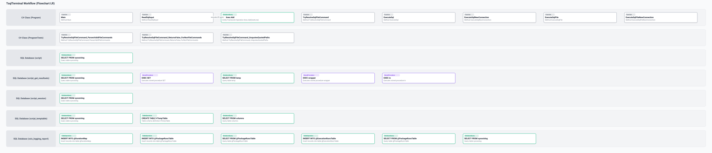

### Mermaid Diagram
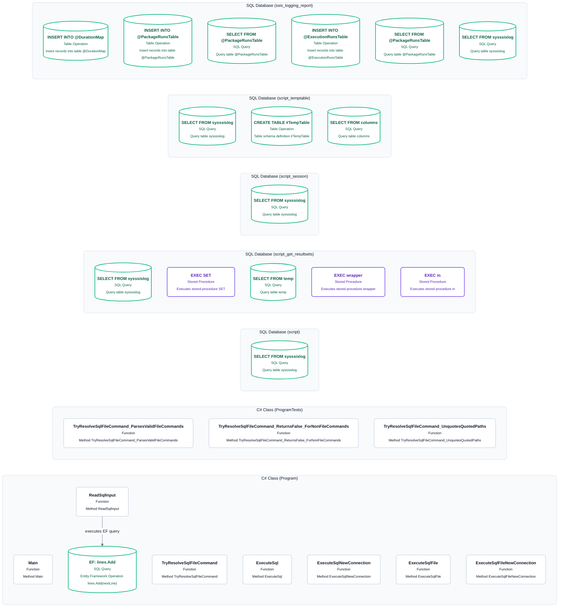

---

## 3. User & Data Journey
A stage-based view of the application’s execution flow from C# code through SQL script execution and report generation.

- **SVG:** [tsql_terminal_journey.svg](tsql_terminal_journey.svg)
- **Mermaid Source:** [tsql_terminal_journey.mmd](tsql_terminal_journey.mmd)

### SVG Visualization
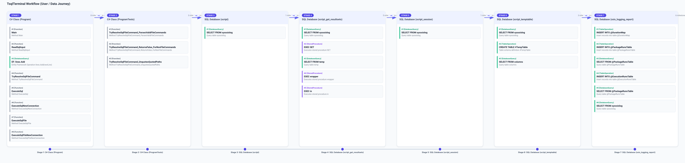

### Mermaid Diagram
```mermaid
%%{init: {"theme": "base", "themeVariables": {"fontFamily": "-apple-system, BlinkMacSystemFont, Segoe UI, Roboto, sans-serif", "fontSize": "13px", "primaryColor": "#FFFFFF", "primaryBorderColor": "#CBD5E1", "primaryTextColor": "#0F172A", "lineColor": "#2563EB", "clusterBkg": "#F8FAFC", "clusterBorder": "#CBD5E1", "edgeLabelBackground": "#FFFFFF"}, "maxTextSize": 1000000}}%%
flowchart LR
    classDef default fill:#FFFFFF,stroke:#CBD5E1,stroke-width:1.5px,color:#0F172A,rx:6px,ry:6px;
    classDef defaultNode fill:#FFFFFF,stroke:#CBD5E1,stroke-width:1.5px,color:#0F172A,rx:6px,ry:6px;
    classDef dbNode fill:#FFFFFF,stroke:#10B981,stroke-width:2px,color:#065F46,rx:6px,ry:6px;
    classDef apiNode fill:#FFFFFF,stroke:#3B82F6,stroke-width:2px,color:#1E40AF,rx:6px,ry:6px;
    classDef scriptNode fill:#FFFFFF,stroke:#6366F1,stroke-width:2px,color:#3730A3,rx:6px,ry:6px;
    classDef procNode fill:#FFFFFF,stroke:#8B5CF6,stroke-width:2px,color:#5B21B6,rx:6px,ry:6px;
    classDef taskNode fill:#FFFFFF,stroke:#F59E0B,stroke-width:2px,color:#92400E,rx:6px,ry:6px;
    classDef assertNode fill:#FFFFFF,stroke:#EC4899,stroke-width:2px,color:#9D174D,rx:6px,ry:6px;
    subgraph stage_2 ["Stage 2: C# Class (Program)"]
        direction TB
        j1["<b>Main</b><br/><small>Function</small><br/><sub>Method Main</sub>"]:::defaultNode
        j2["<b>ReadSqlInput</b><br/><small>Function</small><br/><sub>Method ReadSqlInput</sub>"]:::defaultNode
        j3[("<b>EF: lines.Add</b><br/><small>SQL Query</small><br/><sub>Entity Framework Operation lines.Add(nextLine)</sub>")]:::dbNode
        j4["<b>TryResolveSqlFileCommand</b><br/><small>Function</small><br/><sub>Method TryResolveSqlFileCommand</sub>"]:::defaultNode
        j5["<b>ExecuteSql</b><br/><small>Function</small><br/><sub>Method ExecuteSql</sub>"]:::defaultNode
        j6["<b>ExecuteSqlNewConnection</b><br/><small>Function</small><br/><sub>Method ExecuteSqlNewConnection</sub>"]:::defaultNode
        j7["<b>ExecuteSqlFile</b><br/><small>Function</small><br/><sub>Method ExecuteSqlFile</sub>"]:::defaultNode
        j8["<b>ExecuteSqlFileNewConnection</b><br/><small>Function</small><br/><sub>Method ExecuteSqlFileNewConnection</sub>"]:::defaultNode
    end

    subgraph stage_4 ["Stage 4: C# Class (ProgramTests)"]
        direction TB
        j9["<b>TryResolveSqlFileCommand_ParsesValidFileCommands</b><br/><small>Function</small><br/><sub>Method TryResolveSqlFileCommand_ParsesValidFileCommands</sub>"]:::defaultNode
        j10["<b>TryResolveSqlFileCommand_ReturnsFalse_ForNonFileCommands</b><br/><small>Function</small><br/><sub>Method TryResolveSqlFileCommand_ReturnsFalse_ForNonFileCommands</sub>"]:::defaultNode
        j11["<b>TryResolveSqlFileCommand_UnquotesQuotedPaths</b><br/><small>Function</small><br/><sub>Method TryResolveSqlFileCommand_UnquotesQuotedPaths</sub>"]:::defaultNode
    end

    subgraph stage_5 ["Stage 5: SQL Database (script)"]
        direction TB
        j12[("<b>SELECT FROM sysssislog</b><br/><small>SQL Query</small><br/><sub>Query table sysssislog</sub>")]:::dbNode
    end

    subgraph stage_6 ["Stage 6: SQL Database (script_get_resultsets)"]
        direction TB
        j13[("<b>SELECT FROM sysssislog</b><br/><small>SQL Query</small><br/><sub>Query table sysssislog</sub>")]:::dbNode
        j14["<b>EXEC SET</b><br/><small>Stored Procedure</small><br/><sub>Executes stored procedure SET</sub>"]:::procNode
        j15[("<b>SELECT FROM temp</b><br/><small>SQL Query</small><br/><sub>Query table temp</sub>")]:::dbNode
        j16["<b>EXEC wrapper</b><br/><small>Stored Procedure</small><br/><sub>Executes stored procedure wrapper</sub>"]:::procNode
        j17["<b>EXEC in</b><br/><small>Stored Procedure</small><br/><sub>Executes stored procedure in</sub>"]:::procNode
    end

    subgraph stage_7 ["Stage 7: SQL Database (script_session)"]
        direction TB
        j18[("<b>SELECT FROM sysssislog</b><br/><small>SQL Query</small><br/><sub>Query table sysssislog</sub>")]:::dbNode
    end

    subgraph stage_8 ["Stage 8: SQL Database (script_temptable)"]
        direction TB
        j19[("<b>SELECT FROM sysssislog</b><br/><small>SQL Query</small><br/><sub>Query table sysssislog</sub>")]:::dbNode
        j20[("<b>CREATE TABLE #TempTable</b><br/><small>Table Operation</small><br/><sub>Table schema definition #TempTable</sub>")]:::dbNode
        j21[("<b>SELECT FROM columns</b><br/><small>SQL Query</small><br/><sub>Query table columns</sub>")]:::dbNode
    end

    subgraph stage_9 ["Stage 9: SQL Database (ssis_logging_report)"]
        direction TB
        j22[("<b>INSERT INTO @DurationMap</b><br/><small>Table Operation</small><br/><sub>Insert records into table @DurationMap</sub>")]:::dbNode
        j23[("<b>INSERT INTO @PackageRunsTable</b><br/><small>Table Operation</small><br/><sub>Insert records into table @PackageRunsTable</sub>")]:::dbNode
        j24[("<b>SELECT FROM @PackageRunsTable</b><br/><small>SQL Query</small><br/><sub>Query table @PackageRunsTable</sub>")]:::dbNode
        j25[("<b>INSERT INTO @ExecutionRunsTable</b><br/><small>Table Operation</small><br/><sub>Insert records into table @ExecutionRunsTable</sub>")]:::dbNode
        j26[("<b>SELECT FROM @PackageRunsTable</b><br/><small>SQL Query</small><br/><sub>Query table @PackageRunsTable</sub>")]:::dbNode
        j27[("<b>SELECT FROM sysssislog</b><br/><small>SQL Query</small><br/><sub>Query table sysssislog</sub>")]:::dbNode
    end

    stage_2 ==> stage_4
    stage_4 ==> stage_5
    stage_5 ==> stage_6
    stage_6 ==> stage_7
    stage_7 ==> stage_8
    stage_8 ==> stage_9

    style stage_2 fill:#F8FAFC,stroke:#10B981,stroke-width:2px,rx:8px,ry:8px;
    style stage_4 fill:#F8FAFC,stroke:#F59E0B,stroke-width:2px,rx:8px,ry:8px;
    style stage_5 fill:#F8FAFC,stroke:#EC4899,stroke-width:2px,rx:8px,ry:8px;
    style stage_6 fill:#F8FAFC,stroke:#06B6D4,stroke-width:2px,rx:8px,ry:8px;
    style stage_7 fill:#F8FAFC,stroke:#3B82F6,stroke-width:2px,rx:8px,ry:8px;
    style stage_8 fill:#F8FAFC,stroke:#10B981,stroke-width:2px,rx:8px,ry:8px;
    style stage_9 fill:#F8FAFC,stroke:#8B5CF6,stroke-width:2px,rx:8px,ry:8px;
```

---

## 4. Sequence Diagram
A sequence view showing the C# application calling helper methods and then invoking multiple SQL scripts for result-set processing and reporting.

- **SVG:** [tsql_terminal_sequence.svg](tsql_terminal_sequence.svg)
- **Mermaid Source:** [tsql_terminal_sequence.mmd](tsql_terminal_sequence.mmd)

### SVG Visualization
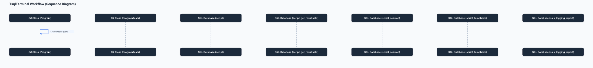

### Mermaid Diagram
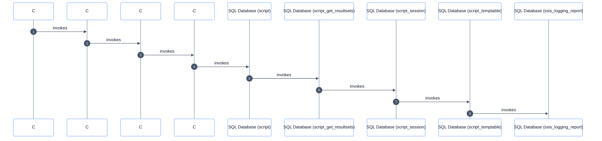

---

## 5. State Diagram
Tracks the program state transitions and the SQL operations it invokes as it resolves file commands and executes result-processing queries.

- **SVG:** [tsql_terminal_state.svg](tsql_terminal_state.svg)
- **Mermaid Source:** [tsql_terminal_state.mmd](tsql_terminal_state.mmd)

### SVG Visualization
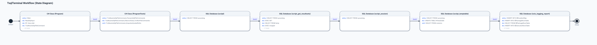

### Mermaid Diagram
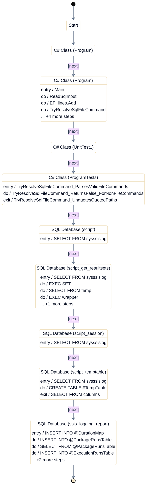

---

## 6. Entity-Relationship (ER) Diagram
A simplified ER view of the database objects involved in result set parsing and reporting.

- **SVG:** [tsql_terminal_er.svg](tsql_terminal_er.svg)
- **Mermaid Source:** [tsql_terminal_er.mmd](tsql_terminal_er.mmd)

### SVG Visualization
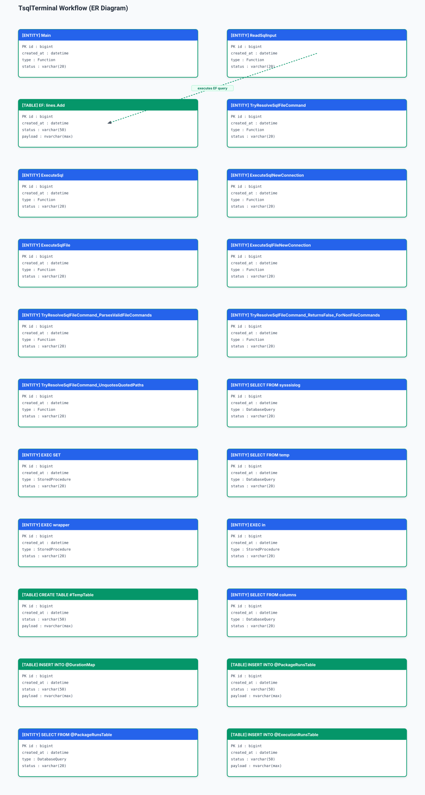

### Mermaid Diagram
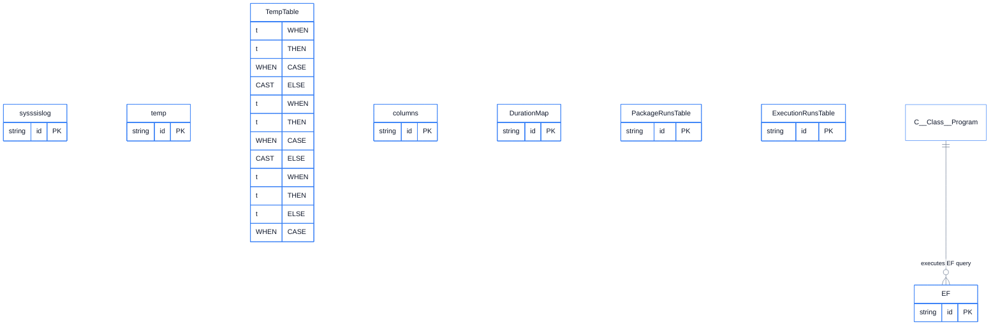

---

## 7. Artifacts Summary

| File Name | Format | Description |
| :--- | :--- | :--- |
| [tsql_terminal.svg](tsql_terminal.svg) | SVG | Top-to-Bottom Flowchart vector graphic |
| [tsql_terminal.mmd](tsql_terminal.mmd) | Mermaid | Top-to-Bottom Flowchart Mermaid definition |
| [tsql_terminal_lr.svg](tsql_terminal_lr.svg) | SVG | Left-to-Right Flowchart vector graphic |
| [tsql_terminal_lr.mmd](tsql_terminal_lr.mmd) | Mermaid | Left-to-Right Flowchart Mermaid definition |
| [tsql_terminal_journey.svg](tsql_terminal_journey.svg) | SVG | User & Data Journey roadmap vector graphic |
| [tsql_terminal_journey.mmd](tsql_terminal_journey.mmd) | Mermaid | User & Data Journey Mermaid definition |
| [tsql_terminal_sequence.svg](tsql_terminal_sequence.svg) | SVG | Lifeline Sequence Diagram vector graphic |
| [tsql_terminal_sequence.mmd](tsql_terminal_sequence.mmd) | Mermaid | Lifeline Sequence Diagram Mermaid definition |
| [tsql_terminal_state.svg](tsql_terminal_state.svg) | SVG | UML State Machine vector graphic |
| [tsql_terminal_state.mmd](tsql_terminal_state.mmd) | Mermaid | UML State Machine Mermaid definition |
| [tsql_terminal_er.svg](tsql_terminal_er.svg) | SVG | Entity-Relationship diagram vector graphic |
| [tsql_terminal_er.mmd](tsql_terminal_er.mmd) | Mermaid | Entity-Relationship Mermaid definition |
| [tsql_terminal.xlsx](tsql_terminal.xlsx) | Excel | Microsoft Visio Data Visualizer compliant workbook |
| [tsql_terminal.json](tsql_terminal.json) | JSON | Canonical AST ProcessModel graph |
