# Google Cloud Billing Pipeline (`gcloud_billing.xml`)

Process analysis and architecture diagrams for [`gcloud_billing.xml`](../../go-flow/examples/gcloud_billing.xml), generated with **CodeFlow**.

### Generation Command
```bash
codeflow.exe analyze --source ..\go-flow\examples\gcloud_billing.xml --recursive --format mermaid,excel,json,svg -n gcloud_billing --diagram-type all --output-dir ./docs/flow --no-truncate
```

---

## Table of Contents
1. [Flowchart (Top-to-Bottom TD)](#1-flowchart-top-to-bottom-td)
2. [Flowchart (Left-to-Right LR)](#2-flowchart-left-to-right-lr)
3. [User & Data Journey](#3-user--data-journey)
4. [Sequence Diagram](#4-sequence-diagram)
5. [State Diagram](#5-state-diagram)
6. [Entity-Relationship (ER) Diagram](#6-entity-relationship-er-diagram)
7. [Artifacts Summary](#7-artifacts-summary)

---

## 1. Flowchart (Top-to-Bottom TD)
Vertical architectural swimlane flowchart showing step execution order across Preflight, Flow, and Database components with typed cards and swimlane styling.

- **SVG:** [gcloud_billing.svg](gcloud_billing.svg)
- **Mermaid Source:** [gcloud_billing.mmd](gcloud_billing.mmd)

### SVG Visualization
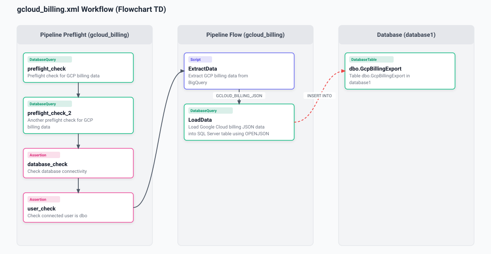

### Mermaid Diagram
```mermaid
%%{init: {"theme": "base", "themeVariables": {"fontFamily": "-apple-system, BlinkMacSystemFont, Segoe UI, Roboto, sans-serif", "fontSize": "13px", "primaryColor": "#FFFFFF", "primaryBorderColor": "#CBD5E1", "primaryTextColor": "#0F172A", "secondaryColor": "#F8FAFC", "tertiaryColor": "#F1F5F9", "lineColor": "#64748B", "textColor": "#0F172A", "mainBkg": "#FFFFFF", "nodeBorder": "#CBD5E1", "clusterBkg": "#F8FAFC", "clusterBorder": "#E2E8F0", "titleColor": "#0F172A", "edgeLabelBackground": "#FFFFFF"}, "maxTextSize": 1000000}}%%
flowchart TD
    classDef default fill:#FFFFFF,stroke:#CBD5E1,stroke-width:1.5px,color:#0F172A,rx:6px,ry:6px;
    classDef defaultNode fill:#FFFFFF,stroke:#CBD5E1,stroke-width:1.5px,color:#0F172A,rx:6px,ry:6px;
    classDef dbNode fill:#FFFFFF,stroke:#10B981,stroke-width:2px,color:#065F46,rx:6px,ry:6px;
    classDef apiNode fill:#FFFFFF,stroke:#3B82F6,stroke-width:2px,color:#1E40AF,rx:6px,ry:6px;
    classDef scriptNode fill:#FFFFFF,stroke:#6366F1,stroke-width:2px,color:#3730A3,rx:6px,ry:6px;
    classDef procNode fill:#FFFFFF,stroke:#8B5CF6,stroke-width:2px,color:#5B21B6,rx:6px,ry:6px;
    classDef taskNode fill:#FFFFFF,stroke:#F59E0B,stroke-width:2px,color:#92400E,rx:6px,ry:6px;
    classDef assertNode fill:#FFFFFF,stroke:#EC4899,stroke-width:2px,color:#9D174D,rx:6px,ry:6px;
    subgraph lane_pipeline_gcloud_billing_preflight ["Pipeline Preflight (gcloud_billing)"]
        s1[("<b>preflight_check</b><br/><small>SQL Query</small>")]:::dbNode
        s2[("<b>preflight_check_2</b><br/><small>SQL Query</small>")]:::dbNode
        s3["<b>database_check</b><br/><small>Assertion</small>"]:::assertNode
        s4["<b>user_check</b><br/><small>Assertion</small>"]:::assertNode
    end

    subgraph lane_pipeline_gcloud_billing_flow ["Pipeline Flow (gcloud_billing)"]
        s5["<b>ExtractData</b><br/><small>Script</small>"]:::scriptNode
        s6[("<b>LoadData</b><br/><small>SQL Query</small>")]:::dbNode
    end

    subgraph lane_db_database1 ["Database (database1)"]
        s7[("<b>dbo.GcpBillingExport</b><br/><small>Database Table</small>")]:::dbNode
    end

    s1 --> s2
    s2 --> s3
    s3 --> s4
    s4 --> s5
    s6 -.->|"INSERT INTO"| s7
    s5 -->|"GCLOUD_BILLING_JSON"| s6

    style lane_pipeline_gcloud_billing_preflight fill:#F8FAFC,stroke:#E2E8F0,stroke-width:1.5px,rx:8px,ry:8px;
    style lane_pipeline_gcloud_billing_flow fill:#F8FAFC,stroke:#E2E8F0,stroke-width:1.5px,rx:8px,ry:8px;
    style lane_db_database1 fill:#F8FAFC,stroke:#E2E8F0,stroke-width:1.5px,rx:8px,ry:8px;
```

---

## 2. Flowchart (Left-to-Right LR)
Horizontal widescreen layout grouping steps into horizontal swimlane rows.

- **SVG:** [gcloud_billing_lr.svg](gcloud_billing_lr.svg)
- **Mermaid Source:** [gcloud_billing_lr.mmd](gcloud_billing_lr.mmd)

### SVG Visualization
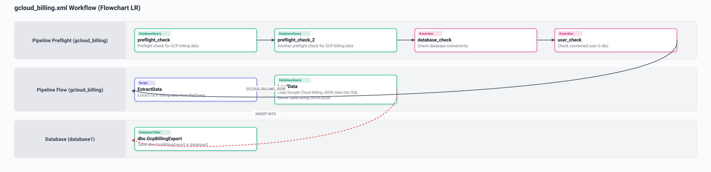

### Mermaid Diagram
```mermaid
%%{init: {"theme": "base", "themeVariables": {"fontFamily": "-apple-system, BlinkMacSystemFont, Segoe UI, Roboto, sans-serif", "fontSize": "13px", "primaryColor": "#FFFFFF", "primaryBorderColor": "#CBD5E1", "primaryTextColor": "#0F172A", "secondaryColor": "#F8FAFC", "tertiaryColor": "#F1F5F9", "lineColor": "#64748B", "textColor": "#0F172A", "mainBkg": "#FFFFFF", "nodeBorder": "#CBD5E1", "clusterBkg": "#F8FAFC", "clusterBorder": "#E2E8F0", "titleColor": "#0F172A", "edgeLabelBackground": "#FFFFFF"}, "maxTextSize": 1000000}}%%
flowchart LR
    classDef default fill:#FFFFFF,stroke:#CBD5E1,stroke-width:1.5px,color:#0F172A,rx:6px,ry:6px;
    classDef defaultNode fill:#FFFFFF,stroke:#CBD5E1,stroke-width:1.5px,color:#0F172A,rx:6px,ry:6px;
    classDef dbNode fill:#FFFFFF,stroke:#10B981,stroke-width:2px,color:#065F46,rx:6px,ry:6px;
    classDef apiNode fill:#FFFFFF,stroke:#3B82F6,stroke-width:2px,color:#1E40AF,rx:6px,ry:6px;
    classDef scriptNode fill:#FFFFFF,stroke:#6366F1,stroke-width:2px,color:#3730A3,rx:6px,ry:6px;
    classDef procNode fill:#FFFFFF,stroke:#8B5CF6,stroke-width:2px,color:#5B21B6,rx:6px,ry:6px;
    classDef taskNode fill:#FFFFFF,stroke:#F59E0B,stroke-width:2px,color:#92400E,rx:6px,ry:6px;
    classDef assertNode fill:#FFFFFF,stroke:#EC4899,stroke-width:2px,color:#9D174D,rx:6px,ry:6px;
    subgraph lane_pipeline_gcloud_billing_preflight ["Pipeline Preflight (gcloud_billing)"]
        s1[("<b>preflight_check</b><br/><small>SQL Query</small>")]:::dbNode
        s2[("<b>preflight_check_2</b><br/><small>SQL Query</small>")]:::dbNode
        s3["<b>database_check</b><br/><small>Assertion</small>"]:::assertNode
        s4["<b>user_check</b><br/><small>Assertion</small>"]:::assertNode
    end

    subgraph lane_pipeline_gcloud_billing_flow ["Pipeline Flow (gcloud_billing)"]
        s5["<b>ExtractData</b><br/><small>Script</small>"]:::scriptNode
        s6[("<b>LoadData</b><br/><small>SQL Query</small>")]:::dbNode
    end

    subgraph lane_db_database1 ["Database (database1)"]
        s7[("<b>dbo.GcpBillingExport</b><br/><small>Database Table</small>")]:::dbNode
    end

    s1 --> s2
    s2 --> s3
    s3 --> s4
    s4 --> s5
    s6 -.->|"INSERT INTO"| s7
    s5 -->|"GCLOUD_BILLING_JSON"| s6

    style lane_pipeline_gcloud_billing_preflight fill:#F8FAFC,stroke:#E2E8F0,stroke-width:1.5px,rx:8px,ry:8px;
    style lane_pipeline_gcloud_billing_flow fill:#F8FAFC,stroke:#E2E8F0,stroke-width:1.5px,rx:8px,ry:8px;
    style lane_db_database1 fill:#F8FAFC,stroke:#E2E8F0,stroke-width:1.5px,rx:8px,ry:8px;
```

---

## 3. User & Data Journey
Milestone roadmap mapping pipeline stages with distinct stage borders and bold milestone transitions (`==>`).

- **SVG:** [gcloud_billing_journey.svg](gcloud_billing_journey.svg)
- **Mermaid Source:** [gcloud_billing_journey.mmd](gcloud_billing_journey.mmd)

### SVG Visualization
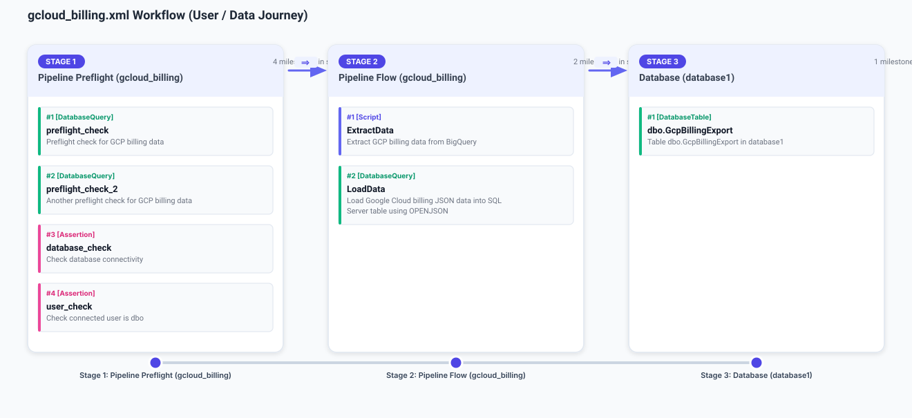

### Mermaid Diagram
```mermaid
%%{init: {"theme": "base", "themeVariables": {"fontFamily": "-apple-system, BlinkMacSystemFont, Segoe UI, Roboto, sans-serif", "fontSize": "13px", "primaryColor": "#FFFFFF", "primaryBorderColor": "#CBD5E1", "primaryTextColor": "#0F172A", "lineColor": "#2563EB", "clusterBkg": "#F8FAFC", "clusterBorder": "#CBD5E1", "edgeLabelBackground": "#FFFFFF"}, "maxTextSize": 1000000}}%%
flowchart LR
    classDef default fill:#FFFFFF,stroke:#CBD5E1,stroke-width:1.5px,color:#0F172A,rx:6px,ry:6px;
    classDef defaultNode fill:#FFFFFF,stroke:#CBD5E1,stroke-width:1.5px,color:#0F172A,rx:6px,ry:6px;
    classDef dbNode fill:#FFFFFF,stroke:#10B981,stroke-width:2px,color:#065F46,rx:6px,ry:6px;
    classDef apiNode fill:#FFFFFF,stroke:#3B82F6,stroke-width:2px,color:#1E40AF,rx:6px,ry:6px;
    classDef scriptNode fill:#FFFFFF,stroke:#6366F1,stroke-width:2px,color:#3730A3,rx:6px,ry:6px;
    classDef procNode fill:#FFFFFF,stroke:#8B5CF6,stroke-width:2px,color:#5B21B6,rx:6px,ry:6px;
    classDef taskNode fill:#FFFFFF,stroke:#F59E0B,stroke-width:2px,color:#92400E,rx:6px,ry:6px;
    classDef assertNode fill:#FFFFFF,stroke:#EC4899,stroke-width:2px,color:#9D174D,rx:6px,ry:6px;
    subgraph stage_1 ["Stage 1: Pipeline Preflight (gcloud_billing)"]
        direction TB
        j1[("<b>preflight_check</b><br/><small>SQL Query</small>")]:::dbNode
        j2[("<b>preflight_check_2</b><br/><small>SQL Query</small>")]:::dbNode
        j3["<b>database_check</b><br/><small>Assertion</small>"]:::assertNode
        j4["<b>user_check</b><br/><small>Assertion</small>"]:::assertNode
    end

    subgraph stage_2 ["Stage 2: Pipeline Flow (gcloud_billing)"]
        direction TB
        j5["<b>ExtractData</b><br/><small>Script</small>"]:::scriptNode
        j6[("<b>LoadData</b><br/><small>SQL Query</small>")]:::dbNode
    end

    subgraph stage_3 ["Stage 3: Database (database1)"]
        direction TB
        j7[("<b>dbo.GcpBillingExport</b><br/><small>Database Table</small>")]:::dbNode
    end

    stage_1 ==> stage_2
    stage_2 ==> stage_3

    style stage_1 fill:#F8FAFC,stroke:#3B82F6,stroke-width:2px,rx:8px,ry:8px;
    style stage_2 fill:#F8FAFC,stroke:#10B981,stroke-width:2px,rx:8px,ry:8px;
    style stage_3 fill:#F8FAFC,stroke:#8B5CF6,stroke-width:2px,rx:8px,ry:8px;
```

---

## 4. Sequence Diagram
Participant lifelines highlighting numbered messages, blue actor cards, and cross-service database interactions.

- **SVG:** [gcloud_billing_sequence.svg](gcloud_billing_sequence.svg)
- **Mermaid Source:** [gcloud_billing_sequence.mmd](gcloud_billing_sequence.mmd)

### SVG Visualization
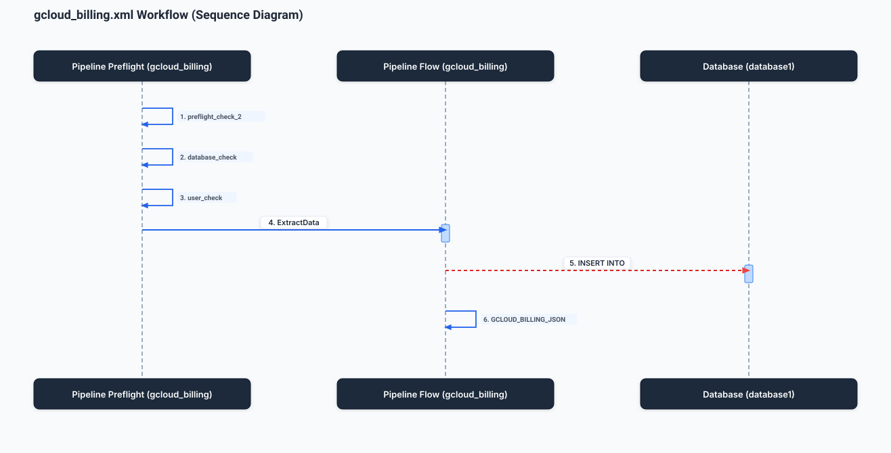

### Mermaid Diagram
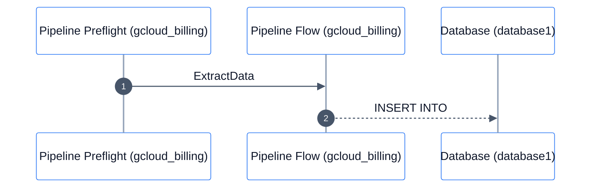

---

## 5. State Diagram
UML state machine tracking pipeline execution progression with internal entry, do, and exit activities and `[next]` transition badges.

- **SVG:** [gcloud_billing_state.svg](gcloud_billing_state.svg)
- **Mermaid Source:** [gcloud_billing_state.mmd](gcloud_billing_state.mmd)

### SVG Visualization
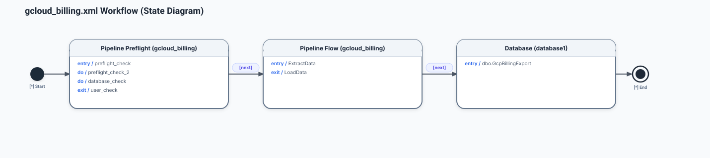

### Mermaid Diagram
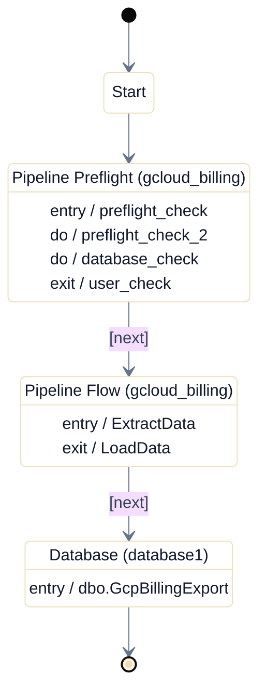

---

## 6. Entity-Relationship (ER) Diagram
Data model and entity schema mapping table structures and queries.

- **SVG:** [gcloud_billing_er.svg](gcloud_billing_er.svg)
- **Mermaid Source:** [gcloud_billing_er.mmd](gcloud_billing_er.mmd)

### SVG Visualization
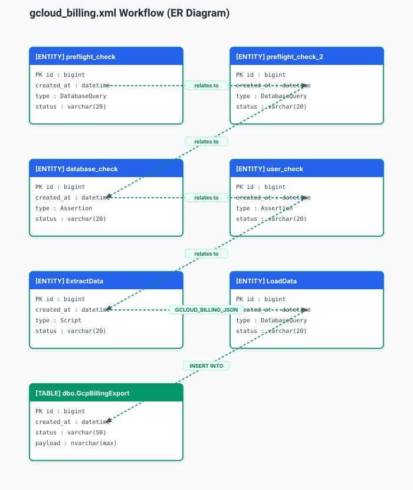

### Mermaid Diagram
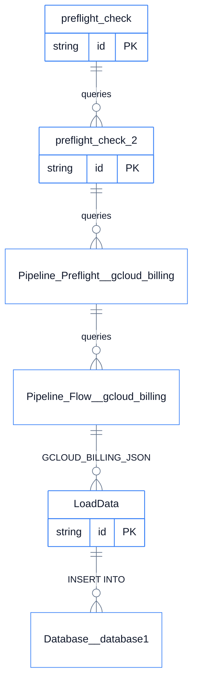

---

## 7. Artifacts Summary

| File Name | Format | Description |
| :--- | :--- | :--- |
| [`gcloud_billing.svg`](gcloud_billing.svg) | SVG | Top-to-Bottom Flowchart vector graphic |
| [`gcloud_billing.mmd`](gcloud_billing.mmd) | Mermaid | Top-to-Bottom Flowchart Mermaid definition |
| [`gcloud_billing_lr.svg`](gcloud_billing_lr.svg) | SVG | Left-to-Right Flowchart vector graphic |
| [`gcloud_billing_lr.mmd`](gcloud_billing_lr.mmd) | Mermaid | Left-to-Right Flowchart Mermaid definition |
| [`gcloud_billing_journey.svg`](gcloud_billing_journey.svg) | SVG | User & Data Journey roadmap vector graphic |
| [`gcloud_billing_journey.mmd`](gcloud_billing_journey.mmd) | Mermaid | User & Data Journey Mermaid definition |
| [`gcloud_billing_sequence.svg`](gcloud_billing_sequence.svg) | SVG | Lifeline Sequence Diagram vector graphic |
| [`gcloud_billing_sequence.mmd`](gcloud_billing_sequence.mmd) | Mermaid | Lifeline Sequence Diagram Mermaid definition |
| [`gcloud_billing_state.svg`](gcloud_billing_state.svg) | SVG | UML State Machine vector graphic |
| [`gcloud_billing_state.mmd`](gcloud_billing_state.mmd) | Mermaid | UML State Machine Mermaid definition |
| [`gcloud_billing_er.svg`](gcloud_billing_er.svg) | SVG | Entity-Relationship diagram vector graphic |
| [`gcloud_billing_er.mmd`](gcloud_billing_er.mmd) | Mermaid | Entity-Relationship Mermaid definition |
| [`gcloud_billing.xlsx`](gcloud_billing.xlsx) | Excel | Microsoft Visio Data Visualizer compliant workbook |
| [`gcloud_billing.json`](gcloud_billing.json) | JSON | Canonical AST ProcessModel graph |