# If/Then/Else Pipeline (`if_than_else.xml`)

Process analysis and architecture diagrams for [`if_than_else.xml`](../../go-flow/examples/if_than_else.xml), generated with **CodeFlow**.

### Generation Command
```bash
codeflow.exe analyze --source ..\go-flow\examples\if_than_else.xml --recursive --format mermaid,excel,json,svg -n if_than_else --diagram-type all --output-dir ./docs/flow --no-truncate
```

---

## Table of Contents
1. [Flowchart (Top-to-Bottom TD)](#1-flowchart-top-to-bottom-td)
2. [Flowchart (Left-to-Right LR)](#2-flowchart-left-to-right-lr)
3. [User & Data Journey](#3-user--data-journey)
4. [Sequence Diagram](#4-sequence-diagram)
5. [State Diagram](#5-state-diagram)
6. [Entity-Relationship (ER) Diagram](#6-entity-relationship-er-diagram)
7. [Artifacts Summary](#7-artifacts-summary)

---

## 1. Flowchart (Top-to-Bottom TD)
Vertical pipeline flow showing a database query, branching condition, and conditional alternative path.

- **SVG:** [if_than_else.svg](if_than_else.svg)
- **Mermaid Source:** [if_than_else.mmd](if_than_else.mmd)

### SVG Visualization
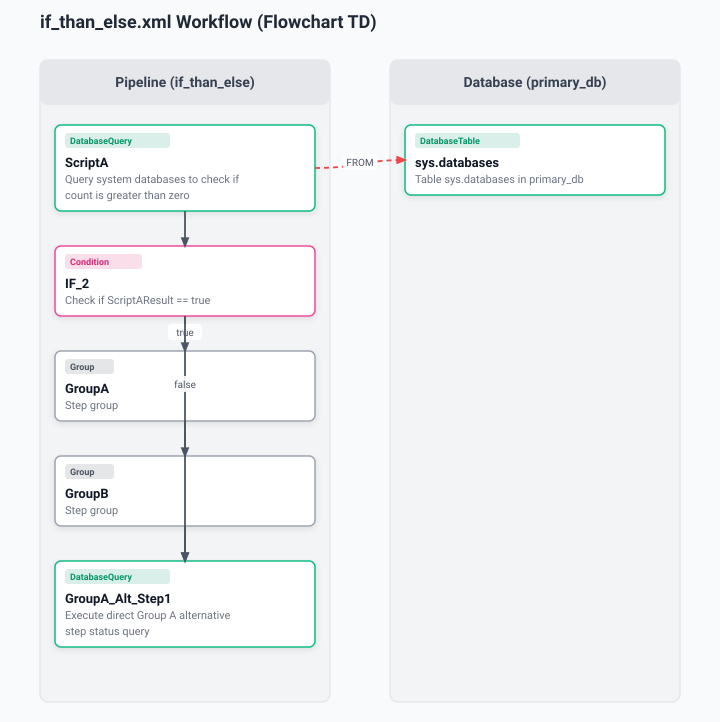

### Mermaid Diagram
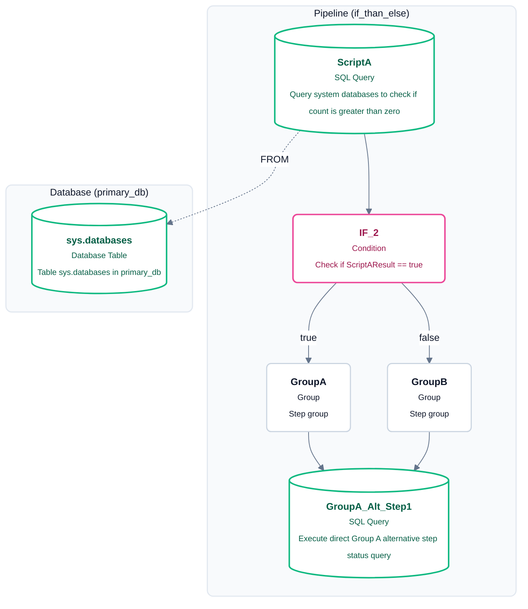

---

## 2. Flowchart (Left-to-Right LR)
Horizontal layout emphasizing the branch split between the true and false execution paths.

- **SVG:** [if_than_else_lr.svg](if_than_else_lr.svg)
- **Mermaid Source:** [if_than_else_lr.mmd](if_than_else_lr.mmd)

### SVG Visualization
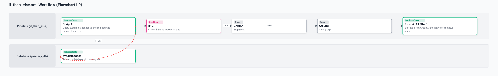

### Mermaid Diagram
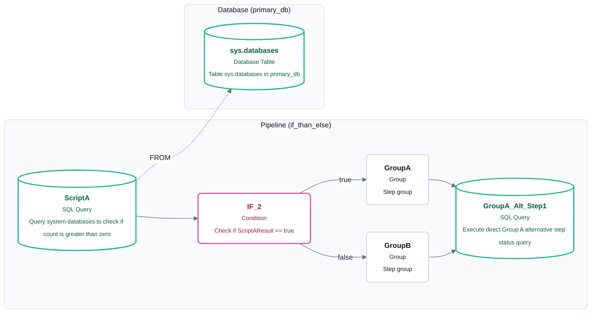

---

## 3. User & Data Journey
A high-level stage view showing the decision branch and the shared downstream query path.

- **SVG:** [if_than_else_journey.svg](if_than_else_journey.svg)
- **Mermaid Source:** [if_than_else_journey.mmd](if_than_else_journey.mmd)

### SVG Visualization
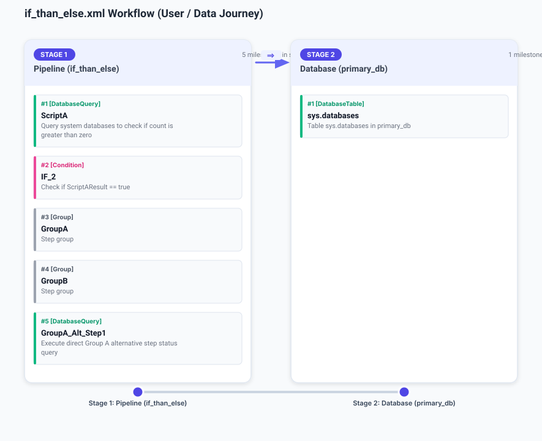

### Mermaid Diagram
```mermaid
%%{init: {"theme": "base", "themeVariables": {"fontFamily": "-apple-system, BlinkMacSystemFont, Segoe UI, Roboto, sans-serif", "fontSize": "13px", "primaryColor": "#FFFFFF", "primaryBorderColor": "#CBD5E1", "primaryTextColor": "#0F172A", "lineColor": "#2563EB", "clusterBkg": "#F8FAFC", "clusterBorder": "#CBD5E1", "edgeLabelBackground": "#FFFFFF"}, "maxTextSize": 1000000}}%%
flowchart LR
    classDef default fill:#FFFFFF,stroke:#CBD5E1,stroke-width:1.5px,color:#0F172A,rx:6px,ry:6px;
    classDef defaultNode fill:#FFFFFF,stroke:#CBD5E1,stroke-width:1.5px,color:#0F172A,rx:6px,ry:6px;
    classDef dbNode fill:#FFFFFF,stroke:#10B981,stroke-width:2px,color:#065F46,rx:6px,ry:6px;
    classDef apiNode fill:#FFFFFF,stroke:#3B82F6,stroke-width:2px,color:#1E40AF,rx:6px,ry:6px;
    classDef scriptNode fill:#FFFFFF,stroke:#6366F1,stroke-width:2px,color:#3730A3,rx:6px,ry:6px;
    classDef procNode fill:#FFFFFF,stroke:#8B5CF6,stroke-width:2px,color:#5B21B6,rx:6px,ry:6px;
    classDef taskNode fill:#FFFFFF,stroke:#F59E0B,stroke-width:2px,color:#92400E,rx:6px,ry:6px;
    classDef assertNode fill:#FFFFFF,stroke:#EC4899,stroke-width:2px,color:#9D174D,rx:6px,ry:6px;
    subgraph stage_1 ["Stage 1: Pipeline (if_than_else)"]
        direction TB
        j1[("<b>ScriptA</b><br/><small>SQL Query</small><br/><sub>Query system databases to check if count is greater than zero</sub>")]:::dbNode
        j2["<b>IF_2</b><br/><small>Condition</small><br/><sub>Check if ScriptAResult == true</sub>"]:::assertNode
        j3["<b>GroupA</b><br/><small>Group</small><br/><sub>Step group</sub>"]:::defaultNode
        j4["<b>GroupB</b><br/><small>Group</small><br/><sub>Step group</sub>"]:::defaultNode
        j5[("<b>GroupA_Alt_Step1</b><br/><small>SQL Query</small><br/><sub>Execute direct Group A alternative step status query</sub>")]:::dbNode
    end

    subgraph stage_2 ["Stage 2: Database (primary_db)"]
        direction TB
        j6[("<b>sys.databases</b><br/><small>Database Table</small><br/><sub>Table sys.databases in primary_db</sub>")]:::dbNode
    end

    stage_1 ==> stage_2

    style stage_1 fill:#F8FAFC,stroke:#3B82F6,stroke-width:2px,rx:8px,ry:8px;
    style stage_2 fill:#F8FAFC,stroke:#10B981,stroke-width:2px,rx:8px,ry:8px;
```

---

## 4. Sequence Diagram
A concise interaction between the pipeline and the primary database, showing the query source and conditional branch behavior.

- **SVG:** [if_than_else_sequence.svg](if_than_else_sequence.svg)
- **Mermaid Source:** [if_than_else_sequence.mmd](if_than_else_sequence.mmd)

### SVG Visualization
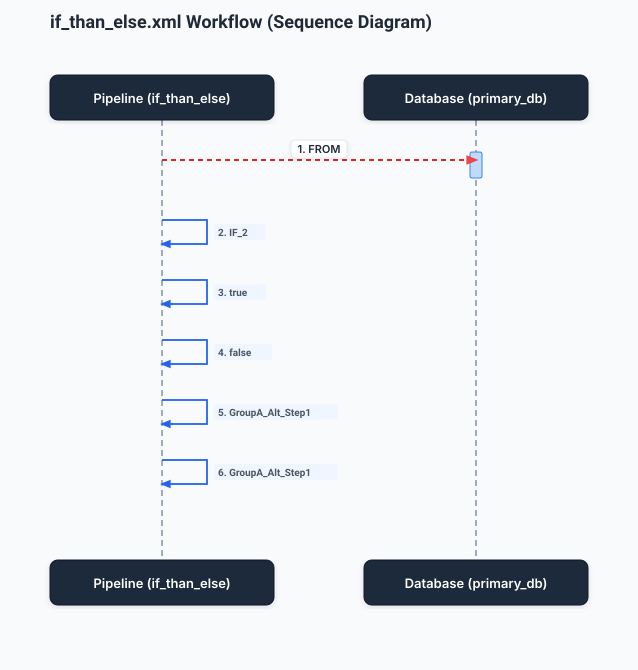

### Mermaid Diagram
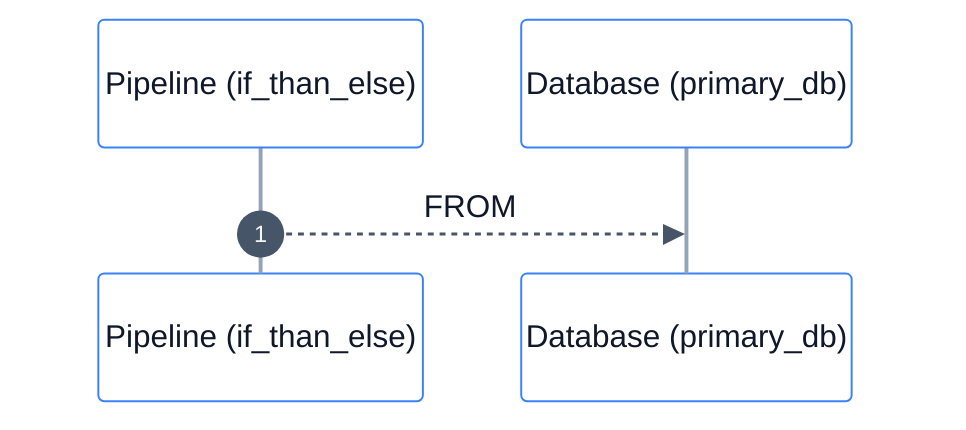

---

## 5. State Diagram
Shows the state machine progression for the conditional pipeline and the primary database source context.

- **SVG:** [if_than_else_state.svg](if_than_else_state.svg)
- **Mermaid Source:** [if_than_else_state.mmd](if_than_else_state.mmd)

### SVG Visualization
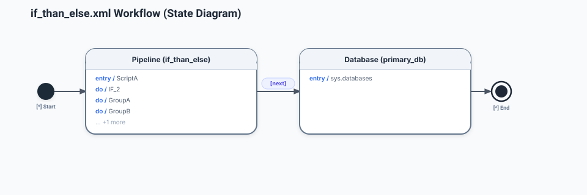

### Mermaid Diagram
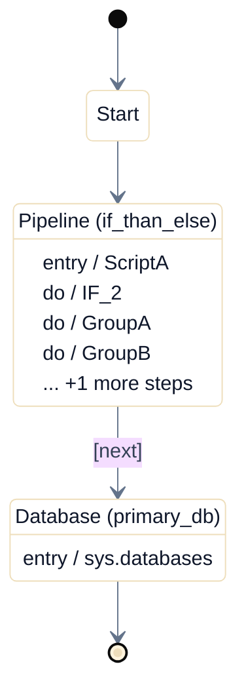

---

## 6. Entity-Relationship (ER) Diagram
Minimal ER schema showing the system database query and the alternative step result relationship in the conditional flow.

- **SVG:** [if_than_else_er.svg](if_than_else_er.svg)
- **Mermaid Source:** [if_than_else_er.mmd](if_than_else_er.mmd)

### SVG Visualization
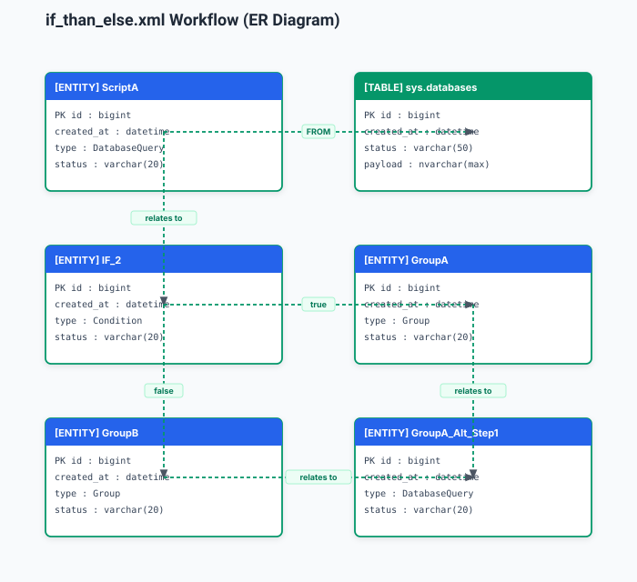

### Mermaid Diagram
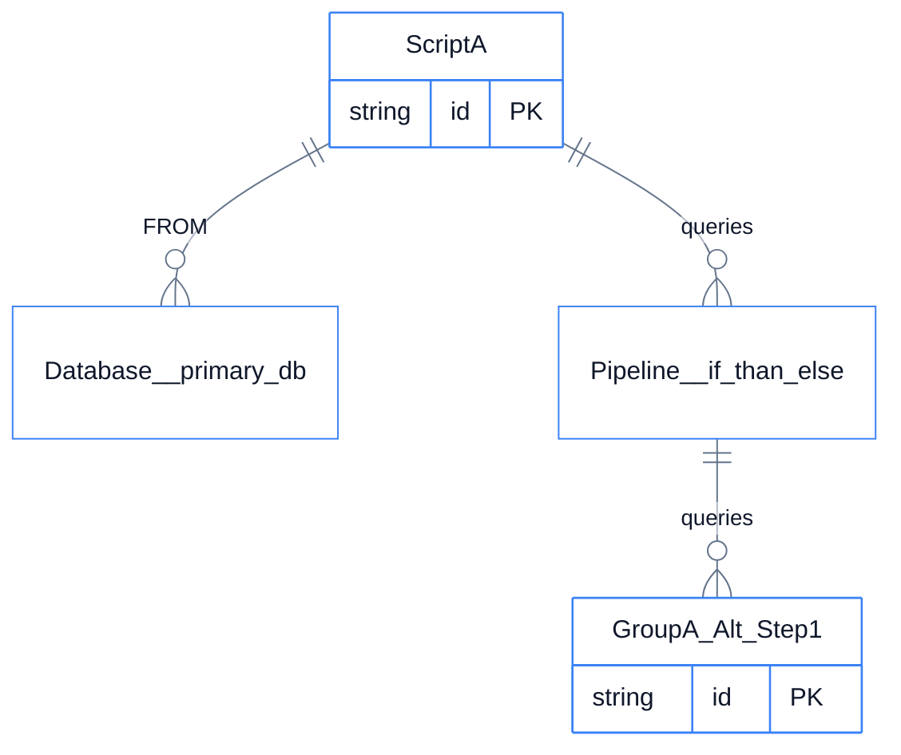

---

## 7. Artifacts Summary

| File Name | Format | Description |
| :--- | :--- | :--- |
| [`if_than_else.svg`](if_than_else.svg) | SVG | Top-to-Bottom Flowchart vector graphic |
| [`if_than_else.mmd`](if_than_else.mmd) | Mermaid | Top-to-Bottom Flowchart Mermaid definition |
| [`if_than_else_lr.svg`](if_than_else_lr.svg) | SVG | Left-to-Right Flowchart vector graphic |
| [`if_than_else_lr.mmd`](if_than_else_lr.mmd) | Mermaid | Left-to-Right Flowchart Mermaid definition |
| [`if_than_else_journey.svg`](if_than_else_journey.svg) | SVG | User & Data Journey roadmap vector graphic |
| [`if_than_else_journey.mmd`](if_than_else_journey.mmd) | Mermaid | User & Data Journey Mermaid definition |
| [`if_than_else_sequence.svg`](if_than_else_sequence.svg) | SVG | Lifeline Sequence Diagram vector graphic |
| [`if_than_else_sequence.mmd`](if_than_else_sequence.mmd) | Mermaid | Lifeline Sequence Diagram Mermaid definition |
| [`if_than_else_state.svg`](if_than_else_state.svg) | SVG | UML State Machine vector graphic |
| [`if_than_else_state.mmd`](if_than_else_state.mmd) | Mermaid | UML State Machine Mermaid definition |
| [`if_than_else_er.svg`](if_than_else_er.svg) | SVG | Entity-Relationship diagram vector graphic |
| [`if_than_else_er.mmd`](if_than_else_er.mmd) | Mermaid | Entity-Relationship Mermaid definition |
| [`if_than_else.xlsx`](if_than_else.xlsx) | Excel | Microsoft Visio Data Visualizer compliant workbook |
| [`if_than_else.json`](if_than_else.json) | JSON | Canonical AST ProcessModel graph |
