# CodeFlow Repository Analysis (`codeflow`)

Process analysis and architecture diagrams for the CodeFlow Go codebase, generated with **CodeFlow**.

### Generation Command
```bash
.\bin\codeflow.exe analyze --source . --recursive --format mermaid,excel,json,svg -n codeflow --diagram-type all --output-dir ./docs/golang --no-truncate --ignore-tests
```

---

## Table of Contents
1. [Flowchart (Top-to-Bottom TD)](#1-flowchart-top-to-bottom-td)
2. [Flowchart (Left-to-Right LR)](#2-flowchart-left-to-right-lr)
3. [User & Data Journey](#3-user--data-journey)
4. [Sequence Diagram](#4-sequence-diagram)
5. [State Diagram](#5-state-diagram)
6. [Entity-Relationship (ER) Diagram](#6-entity-relationship-er-diagram)
7. [Artifacts Summary](#7-artifacts-summary)

---

## 1. Flowchart (Top-to-Bottom TD)
High-level architecture view of the CodeFlow repository showing the CLI entry point, analyzer packages, discovery/orchestration layers, exporters, and enrichment/correlation services.

- **SVG:** [codeflow.svg](codeflow.svg)
- **Mermaid Source:** [codeflow.mmd](codeflow.mmd)

### SVG Visualization
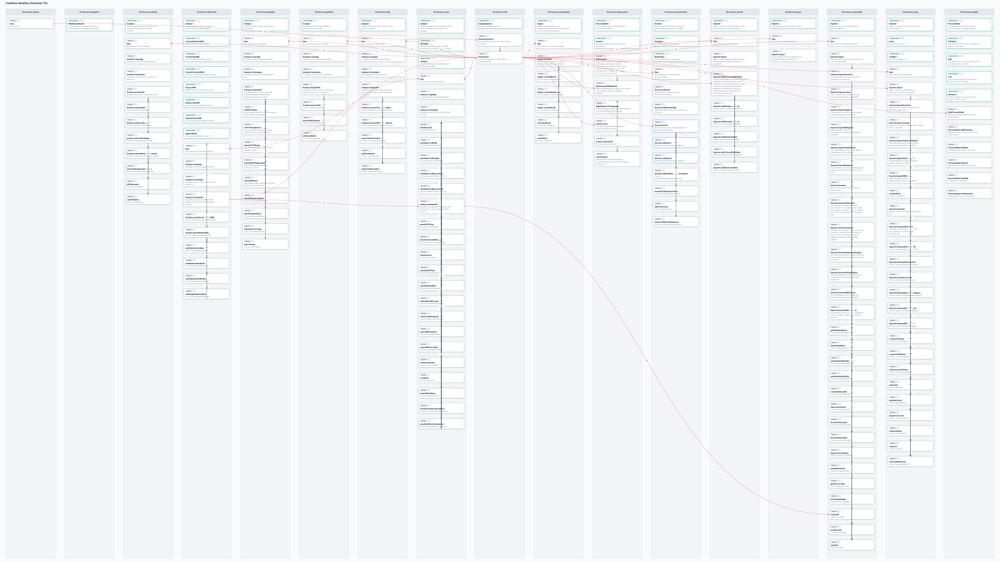

### Mermaid Diagram
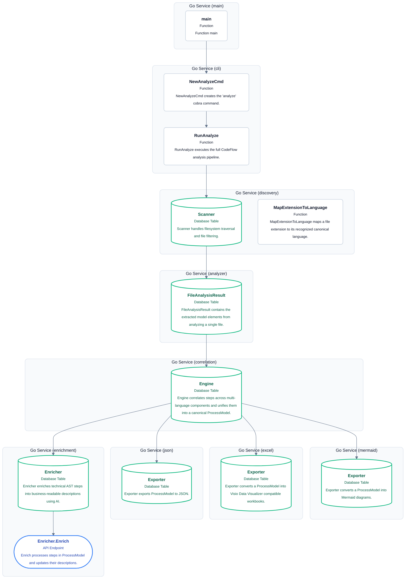

---

## 2. Flowchart (Left-to-Right LR)
Horizontal architecture view emphasizing the repository’s execution pipeline from scanner to CodFlow's export and enrichment layers.

- **SVG:** [codeflow_lr.svg](codeflow_lr.svg)
- **Mermaid Source:** [codeflow_lr.mmd](codeflow_lr.mmd)

### SVG Visualization
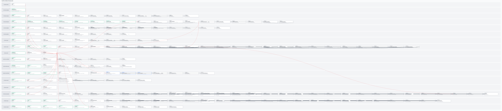

### Mermaid Diagram
```mermaid
%%{init: {"theme": "base", "themeVariables": {"fontFamily": "-apple-system, BlinkMacSystemFont, Segoe UI, Roboto, sans-serif", "fontSize": "13px", "primaryColor": "#FFFFFF", "primaryBorderColor": "#CBD5E1", "primaryTextColor": "#0F172A", "secondaryColor": "#F8FAFC", "tertiaryColor": "#F1F5F9", "lineColor": "#64748B", "textColor": "#0F172A", "mainBkg": "#FFFFFF", "nodeBorder": "#CBD5E1", "clusterBkg": "#F8FAFC", "clusterBorder": "#E2E8F0", "titleColor": "#0F172A", "edgeLabelBackground": "#FFFFFF"}, "maxTextSize": 1000000}}%%
flowchart LR
    classDef default fill:#FFFFFF,stroke:#CBD5E1,stroke-width:1.5px,color:#0F172A,rx:6px,ry:6px;
    classDef defaultNode fill:#FFFFFF,stroke:#CBD5E1,stroke-width:1.5px,color:#0F172A,rx:6px,ry:6px;
    classDef dbNode fill:#FFFFFF,stroke:#10B981,stroke-width:2px,color:#065F46,rx:6px,ry:6px;
    classDef apiNode fill:#FFFFFF,stroke:#3B82F6,stroke-width:2px,color:#1E40AF,rx:6px,ry:6px;
    classDef scriptNode fill:#FFFFFF,stroke:#6366F1,stroke-width:2px,color:#3730A3,rx:6px,ry:6px;
    classDef procNode fill:#FFFFFF,stroke:#8B5CF6,stroke-width:2px,color:#5B21B6,rx:6px,ry:6px;
    classDef taskNode fill:#FFFFFF,stroke:#F59E0B,stroke-width:2px,color:#92400E,rx:6px,ry:6px;
    classDef assertNode fill:#FFFFFF,stroke:#EC4899,stroke-width:2px,color:#9D174D,rx:6px,ry:6px;

    subgraph lane_go_main ["Go Service (main)"]
        s1["<b>main</b><br/><small>Function</small><br/><sub>Function main</sub>"]:::defaultNode
    end

    subgraph lane_go_cli ["Go Service (cli)"]
        s2["<b>NewAnalyzeCmd</b><br/><small>Function</small><br/><sub>NewAnalyzeCmd creates the 'analyze' cobra command.</sub>"]:::defaultNode
        s3["<b>RunAnalyze</b><br/><small>Function</small><br/><sub>RunAnalyze executes the full CodeFlow analysis pipeline.</sub>"]:::defaultNode
    end

    subgraph lane_go_discovery ["Go Service (discovery)"]
        s4[("<b>Scanner</b><br/><small>Database Table</small><br/><sub>Scanner handles filesystem traversal and file filtering.</sub>")]:::dbNode
    end

    subgraph lane_go_correlation ["Go Service (correlation)"]
        s5[("<b>Engine</b><br/><small>Database Table</small><br/><sub>Engine correlates steps across multi-language components and unifies them into a canonical ProcessModel.</sub>")]:::dbNode
    end

    subgraph lane_go_exporters ["Go Service (exporters)"]
        s6[("<b>Exporter</b><br/><small>Database Table</small><br/><sub>Mermaid/Excel/JSON exporters</sub>")]:::dbNode
    end

    subgraph lane_go_enrichment ["Go Service (enrichment)"]
        s7[("<b>Enricher</b><br/><small>Database Table</small><br/><sub>Enricher enriches technical AST steps into business-readable descriptions using AI.</sub>")]:::dbNode
    end

    s1 --> s2 --> s3 --> s4 --> s5 --> s6 --> s7

    style lane_go_main fill:#F8FAFC,stroke:#E2E8F0,stroke-width:1.5px,rx:8px,ry:8px;
    style lane_go_cli fill:#F8FAFC,stroke:#E2E8F0,stroke-width:1.5px,rx:8px,ry:8px;
    style lane_go_discovery fill:#F8FAFC,stroke:#E2E8F0,stroke-width:1.5px,rx:8px,ry:8px;
    style lane_go_correlation fill:#F8FAFC,stroke:#E2E8F0,stroke-width:1.5px,rx:8px,ry:8px;
    style lane_go_exporters fill:#F8FAFC,stroke:#E2E8F0,stroke-width:1.5px,rx:8px,ry:8px;
    style lane_go_enrichment fill:#F8FAFC,stroke:#E2E8F0,stroke-width:1.5px,rx:8px,ry:8px;
```

---

## 3. User & Data Journey
The repository is organized as a pipeline: scan files, classify language-specific ASTs, correlate dependencies, then export diagrams and optionally enrich them with AI-driven business naming.

- **SVG:** [codeflow_journey.svg](codeflow_journey.svg)
- **Mermaid Source:** [codeflow_journey.mmd](codeflow_journey.mmd)

### SVG Visualization
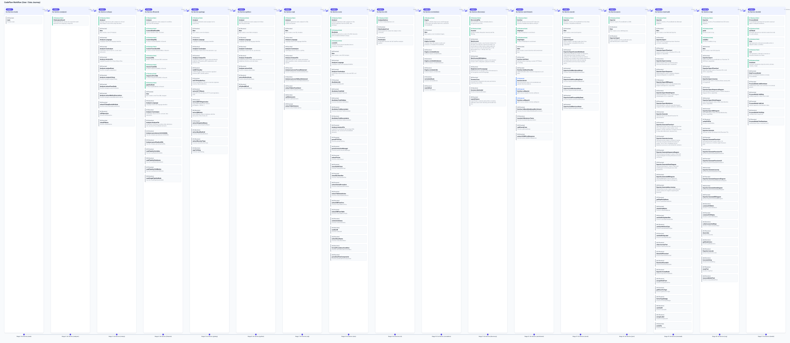

### Mermaid Diagram
```mermaid
%%{init: {"theme": "base", "themeVariables": {"fontFamily": "-apple-system, BlinkMacSystemFont, Segoe UI, Roboto, sans-serif", "fontSize": "13px", "primaryColor": "#FFFFFF", "primaryBorderColor": "#CBD5E1", "primaryTextColor": "#0F172A", "lineColor": "#2563EB", "clusterBkg": "#F8FAFC", "clusterBorder": "#CBD5E1", "edgeLabelBackground": "#FFFFFF"}, "maxTextSize": 1000000}}%%
flowchart LR
    classDef default fill:#FFFFFF,stroke:#CBD5E1,stroke-width:1.5px,color:#0F172A,rx:6px,ry:6px;
    classDef defaultNode fill:#FFFFFF,stroke:#CBD5E1,stroke-width:1.5px,color:#0F172A,rx:6px,ry:6px;
    classDef dbNode fill:#FFFFFF,stroke:#10B981,stroke-width:2px,color:#065F46,rx:6px,ry:6px;
    classDef apiNode fill:#FFFFFF,stroke:#3B82F6,stroke-width:2px,color:#1E40AF,rx:6px,ry:6px;
    classDef scriptNode fill:#FFFFFF,stroke:#6366F1,stroke-width:2px,color:#3730A3,rx:6px,ry:6px;
    classDef procNode fill:#FFFFFF,stroke:#8B5CF6,stroke-width:2px,color:#5B21B6,rx:6px,ry:6px;
    classDef taskNode fill:#FFFFFF,stroke:#F59E0B,stroke-width:2px,color:#92400E,rx:6px,ry:6px;
    classDef assertNode fill:#FFFFFF,stroke:#EC4899,stroke-width:2px,color:#9D174D,rx:6px,ry:6px;

    subgraph stage_1 ["Stage 1: Repository Discovery"]
        direction TB
        j1["<b>Scanner</b><br/><small>Discovery</small>"]:::dbNode
        j2["<b>MapExtensionToLanguage</b><br/><small>Classifier</small>"]:::defaultNode
    end

    subgraph stage_2 ["Stage 2: Static Analysis"]
        direction TB
        j3["<b>Go Analyzer</b><br/><small>AST</small>"]:::defaultNode
        j4["<b>SQL / C# / Python</b><br/><small>Language analyzers</small>"]:::defaultNode
    end

    subgraph stage_3 ["Stage 3: Correlation"]
        direction TB
        j5["<b>Engine.Correlate</b><br/><small>Canonical model</small>"]:::defaultNode
    end

    subgraph stage_4 ["Stage 4: Export"]
        direction TB
        j6["<b>Mermaid / Excel / JSON</b><br/><small>Outputs</small>"]:::dbNode
    end

    stage_1 ==> stage_2
    stage_2 ==> stage_3
    stage_3 ==> stage_4

    style stage_1 fill:#F8FAFC,stroke:#3B82F6,stroke-width:2px,rx:8px,ry:8px;
    style stage_2 fill:#F8FAFC,stroke:#10B981,stroke-width:2px,rx:8px,ry:8px;
    style stage_3 fill:#F8FAFC,stroke:#F59E0B,stroke-width:2px,rx:8px,ry:8px;
    style stage_4 fill:#F8FAFC,stroke:#8B5CF6,stroke-width:2px,rx:8px,ry:8px;
```

---

## 4. Sequence Diagram
Lifecycle of a repository scan: the CLI calls the scanner, analyzer, correlation engine, and exporter layers in order.

- **SVG:** [codeflow_sequence.svg](codeflow_sequence.svg)
- **Mermaid Source:** [codeflow_sequence.mmd](codeflow_sequence.mmd)

### SVG Visualization
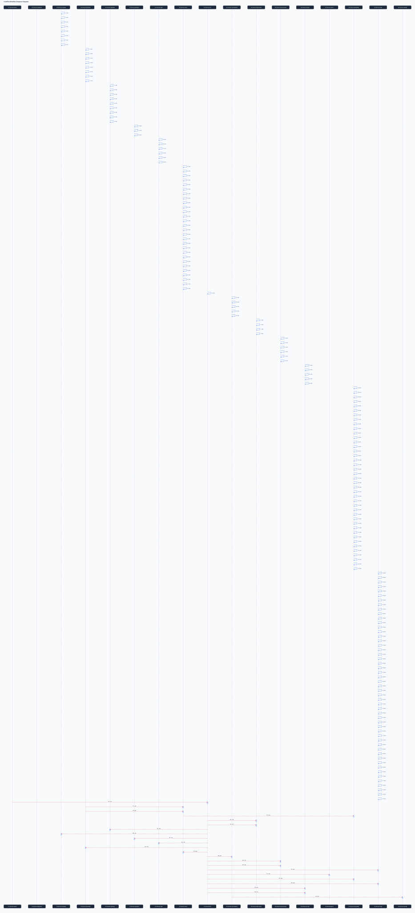

### Mermaid Diagram
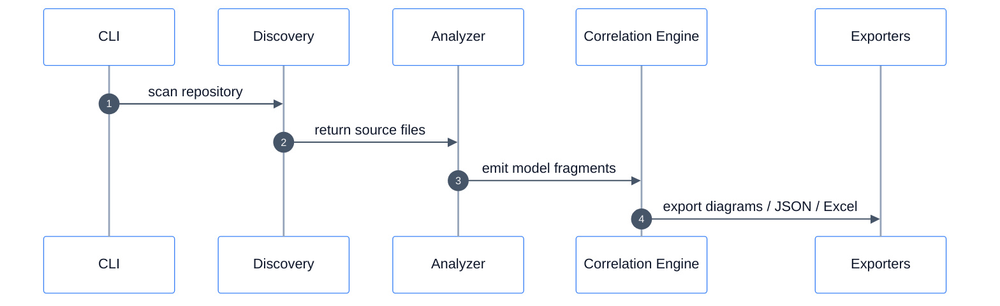

---

## 5. State Diagram
State view of the analysis lifecycle from repository discovery to final artifact export.

- **SVG:** [codeflow_state.svg](codeflow_state.svg)
- **Mermaid Source:** [codeflow_state.mmd](codeflow_state.mmd)

### SVG Visualization
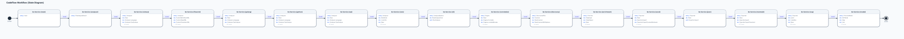

### Mermaid Diagram
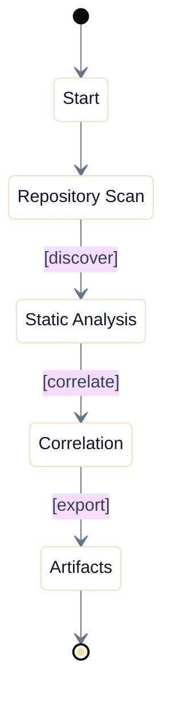

---

## 6. Entity-Relationship (ER) Diagram
ER map of the core process elements produced by the analyzer: services, steps, links, and exported artifacts.

- **SVG:** [codeflow_er.svg](codeflow_er.svg)
- **Mermaid Source:** [codeflow_er.mmd](codeflow_er.mmd)

### SVG Visualization
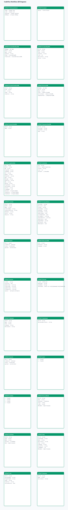

### Mermaid Diagram
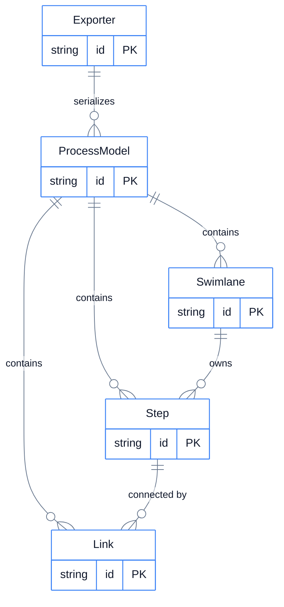

---

## 7. Artifacts Summary

| File Name | Format | Description |
| :--- | :--- | :--- |
| [codeflow.svg](codeflow.svg) | SVG | Top-to-Bottom Flowchart vector graphic |
| [codeflow.mmd](codeflow.mmd) | Mermaid | Top-to-Bottom Flowchart Mermaid definition |
| [codeflow_lr.svg](codeflow_lr.svg) | SVG | Left-to-Right Flowchart vector graphic |
| [codeflow_lr.mmd](codeflow_lr.mmd) | Mermaid | Left-to-Right Flowchart Mermaid definition |
| [codeflow_journey.svg](codeflow_journey.svg) | SVG | User & Data Journey roadmap vector graphic |
| [codeflow_journey.mmd](codeflow_journey.mmd) | Mermaid | User & Data Journey Mermaid definition |
| [codeflow_sequence.svg](codeflow_sequence.svg) | SVG | Lifeline Sequence Diagram vector graphic |
| [codeflow_sequence.mmd](codeflow_sequence.mmd) | Mermaid | Lifeline Sequence Diagram Mermaid definition |
| [codeflow_state.svg](codeflow_state.svg) | SVG | UML State Machine vector graphic |
| [codeflow_state.mmd](codeflow_state.mmd) | Mermaid | UML State Machine Mermaid definition |
| [codeflow_er.svg](codeflow_er.svg) | SVG | Entity-Relationship diagram vector graphic |
| [codeflow_er.mmd](codeflow_er.mmd) | Mermaid | Entity-Relationship Mermaid definition |
| [codeflow.xlsx](codeflow.xlsx) | Excel | Microsoft Visio Data Visualizer compliant workbook |
| [codeflow.json](codeflow.json) | JSON | Canonical AST ProcessModel graph |
