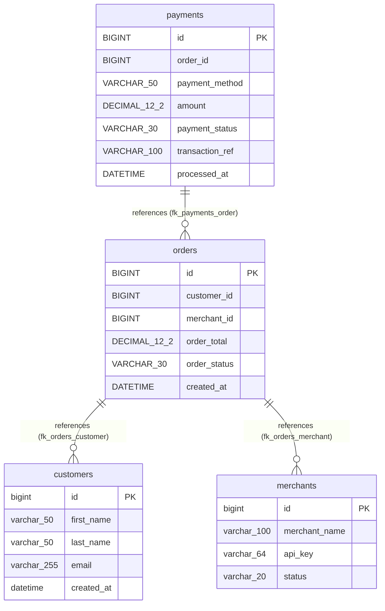
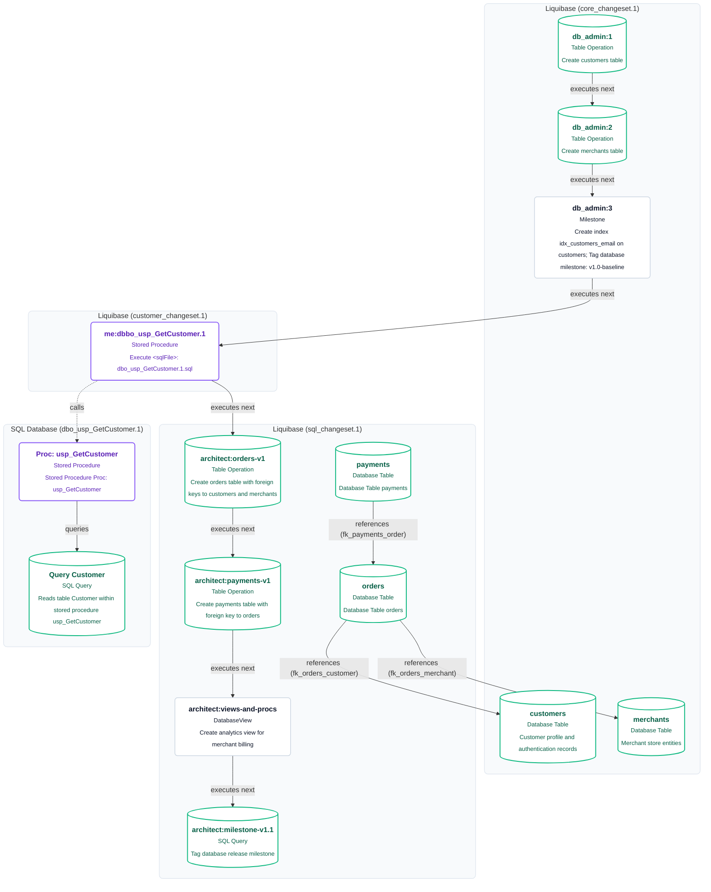

# Liquibase Changelog Architecture & ER Diagrams

This directory contains visual diagrams, process flows, Entity-Relationship (ER) models, and Visio-compatible Excel workbooks generated from Liquibase database migration changelogs.

Source examples located in: [`examples/liquibase/`](../../examples/liquibase/)
- **Primary Master Changelog**: `examples/liquibase/changesets.xml`
- **Core Schema XML Changelog**: `examples/liquibase/changeset/core_changeset.1.xml`
- **Stored Procedure XML Changelog**: `examples/liquibase/changeset/customer_changeset.1.xml`
- **Commerce Transactions Formatted SQL**: `examples/liquibase/changeset/sql_changeset.1.sql`
- **Stored Procedure DDL**: `examples/liquibase/ddl/dbo_usp_GetCustomer.1.sql`

---

## Primary Execution Order

When analyzing database migrations with Liquibase, master/root changelogs (such as `changesets.xml`, `master.xml`, `db.changelog-master.xml`) specify the precise execution order of child changelogs using `<include>` and `<includeAll>`.

You can specify a primary order changelog using the `--primary-changelog` flag (or pass it directly via `--source`):

```bash
.\bin\codeflow.exe analyze \
  --source ./examples/liquibase \
  --primary-changelog ./examples/liquibase/changesets.xml \
  --recursive \
  --format mermaid,excel,json,svg \
  -n liquibase \
  --diagram-type all \
  --output-dir ./docs/liquibase \
  --no-truncate
```

### Key Execution Capabilities
1. **Deterministic Execution Sequence**: Changsets execute sequentially across changelog files (`core_changeset` &rarr; `customer_changeset` &rarr; `sql_changeset`).
2. **Continuous Execution Chain**: The execution chain (`executes next`) flows continuously across changelog boundaries without interruption.
3. **Cumulative Schema Tracking**: Table structures, column additions, and constraints evolve across files so foreign keys reference tables defined in earlier changelogs.
4. **Multi-Format Inclusions**: Seamlessly traverses XML changelogs, Formatted SQL files (`--liquibase formatted sql`), and `<sqlFile>` references.

---

## 1. Entity-Relationship (ER) Model

Shows the cumulative database schema with primary keys (`PK`), column types, and foreign key relationships (`||--o{`) correlated across changelog files.

### Standalone Vector Image
- **SVG**: [liquibase_er.svg](liquibase_er.svg)

### Mermaid ER Diagram


---

## 2. Top-Down Flowchart (Flowchart TD)

Shows changeSets grouped by changelog file swimlanes, unbroken sequential execution order across files, and cross-file foreign key dependencies.

### Standalone Vector Image
- **SVG**: [liquibase.svg](liquibase.svg)

### Mermaid Flowchart


---

## 3. Left-to-Right Flowchart (Flowchart LR)

Optimized for horizontal readability across complex multi-step pipelines.

- **Mermaid**: [liquibase_lr.mmd](liquibase_lr.mmd)
- **SVG**: [liquibase_lr.svg](liquibase_lr.svg)

---

## 4. Lifecycle Journey & State Diagrams

- **User/Pipeline Journey**: [liquibase_journey.mmd](liquibase_journey.mmd) | [SVG](liquibase_journey.svg)
- **Execution Sequence**: [liquibase_sequence.mmd](liquibase_sequence.mmd) | [SVG](liquibase_sequence.svg)
- **Database State Transition**: [liquibase_state.mmd](liquibase_state.mmd) | [SVG](liquibase_state.svg)

---

## 5. Structured Data and Visio Workbooks

- **Visio-Compatible Excel Workbook**: [liquibase.xlsx](liquibase.xlsx)
  - Contains step IDs, swimlanes, changeSet authors, labels, contexts, rollback scripts, and incoming/outgoing connectors ready for Visio Data Visualizer import.
- **Canonical ProcessModel JSON**: [liquibase.json](liquibase.json)
