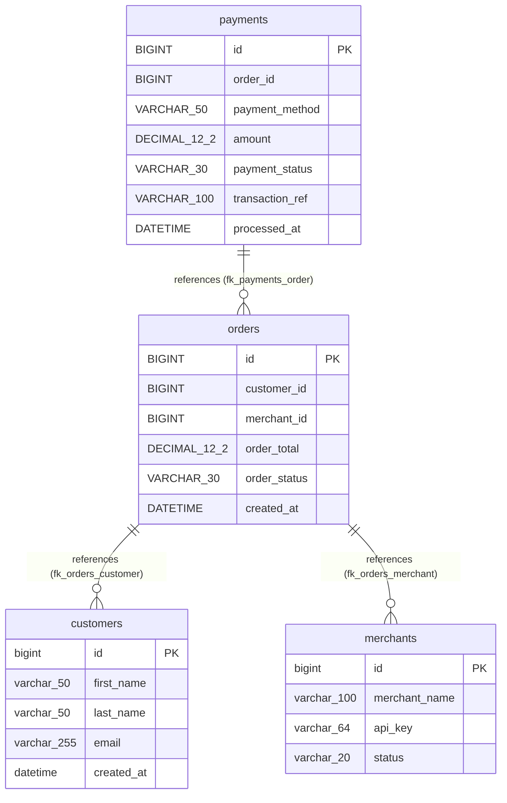

# Liquibase Changelog Architecture & ER Diagrams

This directory contains the visual diagrams, process flows, Entity-Relationship (ER) models, and Visio-compatible Excel workbooks generated from Liquibase database migration changelogs.

Source examples located in: [`examples/liquibase/`](../../examples/liquibase/)
- **XML Changelog**: `examples/liquibase/01_core_schema.xml`
- **Formatted SQL Changelog**: `examples/liquibase/02_orders_and_payments.sql`

---

## 1. Entity-Relationship (ER) Model

Shows the cumulative database schema with primary keys (`PK`), column types, and foreign key relationships (`||--o{`) correlated across changelog files.

### Standalone Vector Image
- **SVG**: [liquibase_er.svg](liquibase_er.svg)

### Mermaid ER Diagram


---

## 2. Top-Down Flowchart (Flowchart TD)

Shows changeSets grouped by changelog file swimlanes, sequential execution order, milestones, and cross-file foreign key dependencies.

### Standalone Vector Image
- **SVG**: [liquibase.svg](liquibase.svg)

### Mermaid Flowchart
```mermaid
flowchart TD
    classDef default fill:#FFFFFF,stroke:#CBD5E1,stroke-width:1.5px,color:#0F172A,rx:6px,ry:6px;
    classDef defaultNode fill:#FFFFFF,stroke:#CBD5E1,stroke-width:1.5px,color:#0F172A,rx:6px,ry:6px;
    classDef dbNode fill:#FFFFFF,stroke:#10B981,stroke-width:2px,color:#065F46,rx:6px,ry:6px;
    classDef apiNode fill:#FFFFFF,stroke:#3B82F6,stroke-width:2px,color:#1E40AF,rx:6px,ry:6px;
    classDef scriptNode fill:#FFFFFF,stroke:#6366F1,stroke-width:2px,color:#3730A3,rx:6px,ry:6px;
    classDef procNode fill:#FFFFFF,stroke:#8B5CF6,stroke-width:2px,color:#5B21B6,rx:6px,ry:6px;
    classDef taskNode fill:#FFFFFF,stroke:#F59E0B,stroke-width:2px,color:#92400E,rx:6px,ry:6px;
    classDef assertNode fill:#FFFFFF,stroke:#EC4899,stroke-width:2px,color:#9D174D,rx:6px,ry:6px;
    subgraph lane_lane_liquibase_01_core_schema ["Liquibase (01_core_schema)"]
        s1[("<b>db_admin:1</b><br/><small>Table Operation</small><br/><sub>Create customers table</sub>")]:::dbNode
        s2[("<b>db_admin:2</b><br/><small>Table Operation</small><br/><sub>Create merchants table</sub>")]:::dbNode
        s3["<b>db_admin:3</b><br/><small>Milestone</small><br/><sub>Create index idx_customers_email on customers; Tag database milestone: v1.0-baseline</sub>"]:::defaultNode
        s4[("<b>customers</b><br/><small>Database Table</small><br/><sub>Customer profile and authentication records</sub>")]:::dbNode
        s5[("<b>merchants</b><br/><small>Database Table</small><br/><sub>Merchant store entities</sub>")]:::dbNode
    end

    subgraph lane_lane_liquibase_02_orders_and_payments ["Liquibase (02_orders_and_payments)"]
        s6[("<b>architect:orders-v1</b><br/><small>Table Operation</small><br/><sub>Create orders table with foreign keys to customers and merchants</sub>")]:::dbNode
        s7[("<b>architect:payments-v1</b><br/><small>Table Operation</small><br/><sub>Create payments table with foreign key to orders</sub>")]:::dbNode
        s8[["<b>architect:views-and-procs</b><br/><small>Database View</small><br/><sub>Create analytics view for merchant billing</sub>"]):::procNode
        s9[("<b>architect:milestone-v1.1</b><br/><small>SQL Query</small><br/><sub>Tag database release milestone</sub>")]:::dbNode
        s10[("<b>orders</b><br/><small>Database Table</small><br/><sub>Database Table orders</sub>")]:::dbNode
        s11[("<b>payments</b><br/><small>Database Table</small><br/><sub>Database Table payments</sub>")]:::dbNode
    end

    s1 -->|"executes next"| s2
    s2 -->|"executes next"| s3
    s6 -->|"executes next"| s7
    s7 -->|"executes next"| s8
    s8 -->|"executes next"| s9
    s11 -->|"references (fk_payments_order)"| s10
    s10 -.->|"references (fk_orders_customer)"| s4
    s10 -.->|"references (fk_orders_merchant)"| s5

    style lane_lane_liquibase_01_core_schema fill:#F8FAFC,stroke:#E2E8F0,stroke-width:1.5px,rx:8px,ry:8px;
    style lane_lane_liquibase_02_orders_and_payments fill:#F8FAFC,stroke:#E2E8F0,stroke-width:1.5px,rx:8px,ry:8px;
```

---

## 3. Left-to-Right Flowchart (Flowchart LR)

- **SVG**: [liquibase_lr.svg](liquibase_lr.svg)
- **Mermaid Source**: [liquibase_lr.mmd](liquibase_lr.mmd)

---

## 4. Universal Migration Journey

- **SVG**: [liquibase_journey.svg](liquibase_journey.svg)
- **Mermaid Source**: [liquibase_journey.mmd](liquibase_journey.mmd)

---

## 5. Lifeline Sequence Diagram

- **SVG**: [liquibase_sequence.svg](liquibase_sequence.svg)
- **Mermaid Source**: [liquibase_sequence.mmd](liquibase_sequence.mmd)

---

## 6. Migration State Diagram

- **SVG**: [liquibase_state.svg](liquibase_state.svg)
- **Mermaid Source**: [liquibase_state.mmd](liquibase_state.mmd)

---

## 7. Data Exports

- **Microsoft Visio / Excel Workbook**: [liquibase.xlsx](liquibase.xlsx)
- **Canonical ProcessModel JSON**: [liquibase.json](liquibase.json)
