# SSIS Package Process Models: 7045kHz_cross_db_collection

This directory contains the visual diagrams, process graphs, and export artifacts generated by **CodeFlow** from the SSIS Package `7045kHz_cross_db_collection.dtsx`.

---

## 1. Flowchart TD (Top-Down Swimlanes)

### SVG Render
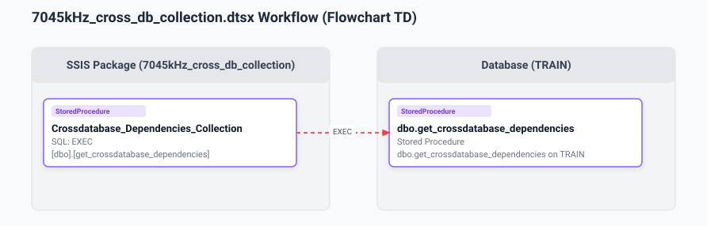

### Mermaid Definition
```mermaid
%%{init: {"theme": "base", "themeVariables": {"fontFamily": "-apple-system, BlinkMacSystemFont, Segoe UI, Roboto, sans-serif", "fontSize": "13px", "primaryColor": "#FFFFFF", "primaryBorderColor": "#CBD5E1", "primaryTextColor": "#0F172A", "secondaryColor": "#F8FAFC", "tertiaryColor": "#F1F5F9", "lineColor": "#64748B", "textColor": "#0F172A", "mainBkg": "#FFFFFF", "nodeBorder": "#CBD5E1", "clusterBkg": "#F8FAFC", "clusterBorder": "#E2E8F0", "titleColor": "#0F172A", "edgeLabelBackground": "#FFFFFF"}, "maxTextSize": 1000000}}%%
flowchart TD
    classDef default fill:#FFFFFF,stroke:#CBD5E1,stroke-width:1.5px,color:#0F172A,rx:6px,ry:6px;
    classDef defaultNode fill:#FFFFFF,stroke:#CBD5E1,stroke-width:1.5px,color:#0F172A,rx:6px,ry:6px;
    classDef dbNode fill:#FFFFFF,stroke:#10B981,stroke-width:2px,color:#065F46,rx:6px,ry:6px;
    classDef apiNode fill:#FFFFFF,stroke:#3B82F6,stroke-width:2px,color:#1E40AF,rx:6px,ry:6px;
    classDef scriptNode fill:#FFFFFF,stroke:#6366F1,stroke-width:2px,color:#3730A3,rx:6px,ry:6px;
    classDef procNode fill:#FFFFFF,stroke:#8B5CF6,stroke-width:2px,color:#5B21B6,rx:6px,ry:6px;
    classDef taskNode fill:#FFFFFF,stroke:#F59E0B,stroke-width:2px,color:#92400E,rx:6px,ry:6px;
    classDef assertNode fill:#FFFFFF,stroke:#EC4899,stroke-width:2px,color:#9D174D,rx:6px,ry:6px;
    subgraph lane_ssis_7045kHz_cross_db_collection ["SSIS Package (7045kHz_cross_db_collection)"]
        s1["<b>Crossdatabase_Dependencies_Collection</b><br/><small>Stored Procedure</small><br/><sub>SQL: EXEC &#91;dbo&#93;.&#91;get_crossdatabase_dependencies&#93;</sub>"]:::procNode
    end

    subgraph lane_db_train ["Database (TRAIN)"]
        s2["<b>dbo.get_crossdatabase_dependencies</b><br/><small>Stored Procedure</small><br/><sub>Stored Procedure dbo.get_crossdatabase_dependencies on TRAIN</sub>"]:::procNode
    end

    s1 -.->|"EXEC"| s2

    style lane_ssis_7045kHz_cross_db_collection fill:#F8FAFC,stroke:#E2E8F0,stroke-width:1.5px,rx:8px,ry:8px;
    style lane_db_train fill:#F8FAFC,stroke:#E2E8F0,stroke-width:1.5px,rx:8px,ry:8px;
```

---

## 2. Flowchart LR (Horizontal Swimlane Bands)

### SVG Render
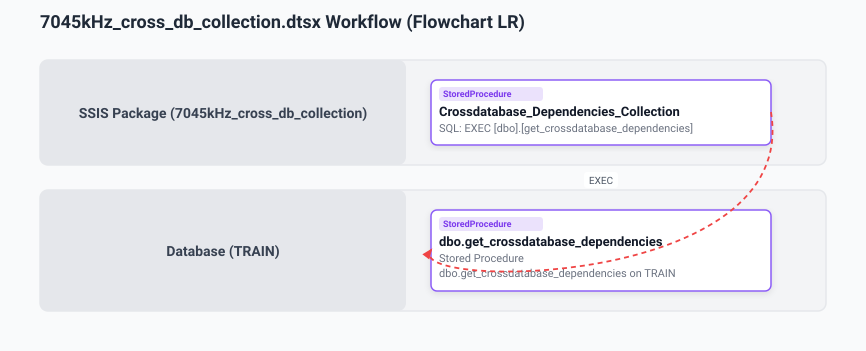

### Mermaid Definition
```mermaid
%%{init: {"theme": "base", "themeVariables": {"fontFamily": "-apple-system, BlinkMacSystemFont, Segoe UI, Roboto, sans-serif", "fontSize": "13px", "primaryColor": "#FFFFFF", "primaryBorderColor": "#CBD5E1", "primaryTextColor": "#0F172A", "secondaryColor": "#F8FAFC", "tertiaryColor": "#F1F5F9", "lineColor": "#64748B", "textColor": "#0F172A", "mainBkg": "#FFFFFF", "nodeBorder": "#CBD5E1", "clusterBkg": "#F8FAFC", "clusterBorder": "#E2E8F0", "titleColor": "#0F172A", "edgeLabelBackground": "#FFFFFF"}, "maxTextSize": 1000000}}%%
flowchart LR
    classDef default fill:#FFFFFF,stroke:#CBD5E1,stroke-width:1.5px,color:#0F172A,rx:6px,ry:6px;
    classDef defaultNode fill:#FFFFFF,stroke:#CBD5E1,stroke-width:1.5px,color:#0F172A,rx:6px,ry:6px;
    classDef dbNode fill:#FFFFFF,stroke:#10B981,stroke-width:2px,color:#065F46,rx:6px,ry:6px;
    classDef apiNode fill:#FFFFFF,stroke:#3B82F6,stroke-width:2px,color:#1E40AF,rx:6px,ry:6px;
    classDef scriptNode fill:#FFFFFF,stroke:#6366F1,stroke-width:2px,color:#3730A3,rx:6px,ry:6px;
    classDef procNode fill:#FFFFFF,stroke:#8B5CF6,stroke-width:2px,color:#5B21B6,rx:6px,ry:6px;
    classDef taskNode fill:#FFFFFF,stroke:#F59E0B,stroke-width:2px,color:#92400E,rx:6px,ry:6px;
    classDef assertNode fill:#FFFFFF,stroke:#EC4899,stroke-width:2px,color:#9D174D,rx:6px,ry:6px;
    subgraph lane_ssis_7045kHz_cross_db_collection ["SSIS Package (7045kHz_cross_db_collection)"]
        s1["<b>Crossdatabase_Dependencies_Collection</b><br/><small>Stored Procedure</small><br/><sub>SQL: EXEC &#91;dbo&#93;.&#91;get_crossdatabase_dependencies&#93;</sub>"]:::procNode
    end

    subgraph lane_db_train ["Database (TRAIN)"]
        s2["<b>dbo.get_crossdatabase_dependencies</b><br/><small>Stored Procedure</small><br/><sub>Stored Procedure dbo.get_crossdatabase_dependencies on TRAIN</sub>"]:::procNode
    end

    s1 -.->|"EXEC"| s2

    style lane_ssis_7045kHz_cross_db_collection fill:#F8FAFC,stroke:#E2E8F0,stroke-width:1.5px,rx:8px,ry:8px;
    style lane_db_train fill:#F8FAFC,stroke:#E2E8F0,stroke-width:1.5px,rx:8px,ry:8px;
```

---

## 3. Milestone Journey Diagram

### SVG Render
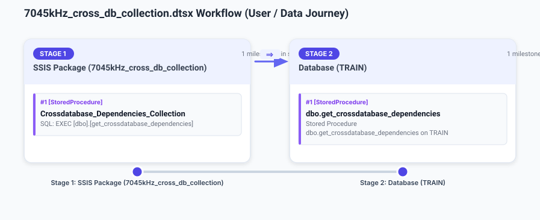

### Mermaid Definition
```mermaid
%%{init: {"theme": "base", "themeVariables": {"fontFamily": "-apple-system, BlinkMacSystemFont, Segoe UI, Roboto, sans-serif", "fontSize": "13px", "primaryColor": "#FFFFFF", "primaryBorderColor": "#CBD5E1", "primaryTextColor": "#0F172A", "lineColor": "#2563EB", "clusterBkg": "#F8FAFC", "clusterBorder": "#CBD5E1", "edgeLabelBackground": "#FFFFFF"}, "maxTextSize": 1000000}}%%
flowchart LR
    classDef default fill:#FFFFFF,stroke:#CBD5E1,stroke-width:1.5px,color:#0F172A,rx:6px,ry:6px;
    classDef defaultNode fill:#FFFFFF,stroke:#CBD5E1,stroke-width:1.5px,color:#0F172A,rx:6px,ry:6px;
    classDef dbNode fill:#FFFFFF,stroke:#10B981,stroke-width:2px,color:#065F46,rx:6px,ry:6px;
    classDef apiNode fill:#FFFFFF,stroke:#3B82F6,stroke-width:2px,color:#1E40AF,rx:6px,ry:6px;
    classDef scriptNode fill:#FFFFFF,stroke:#6366F1,stroke-width:2px,color:#3730A3,rx:6px,ry:6px;
    classDef procNode fill:#FFFFFF,stroke:#8B5CF6,stroke-width:2px,color:#5B21B6,rx:6px,ry:6px;
    classDef taskNode fill:#FFFFFF,stroke:#F59E0B,stroke-width:2px,color:#92400E,rx:6px,ry:6px;
    classDef assertNode fill:#FFFFFF,stroke:#EC4899,stroke-width:2px,color:#9D174D,rx:6px,ry:6px;
    subgraph stage_1 ["Stage 1: SSIS Package (7045kHz_cross_db_collection)"]
        direction TB
        j1["<b>Crossdatabase_Dependencies_Collection</b><br/><small>Stored Procedure</small><br/><sub>SQL: EXEC &#91;dbo&#93;.&#91;get_crossdatabase_dependencies&#93;</sub>"]:::procNode
    end

    subgraph stage_2 ["Stage 2: Database (TRAIN)"]
        direction TB
        j2["<b>dbo.get_crossdatabase_dependencies</b><br/><small>Stored Procedure</small><br/><sub>Stored Procedure dbo.get_crossdatabase_dependencies on TRAIN</sub>"]:::procNode
    end

    stage_1 ==> stage_2

    style stage_1 fill:#F8FAFC,stroke:#3B82F6,stroke-width:2px,rx:8px,ry:8px;
    style stage_2 fill:#F8FAFC,stroke:#10B981,stroke-width:2px,rx:8px,ry:8px;
```

---

## 4. Sequence Diagram

### SVG Render
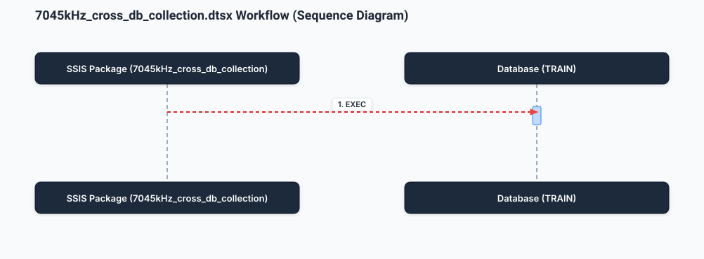

### Mermaid Definition
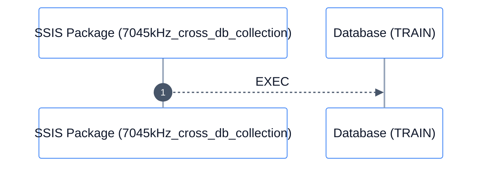

---

## 5. State Machine Diagram

### SVG Render
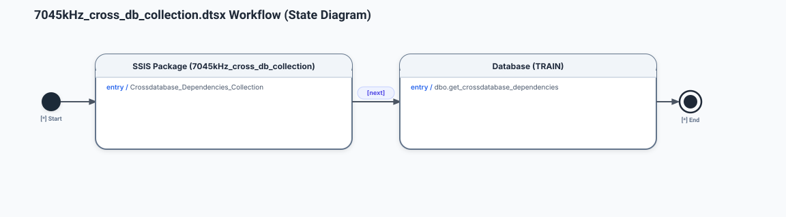

### Mermaid Definition
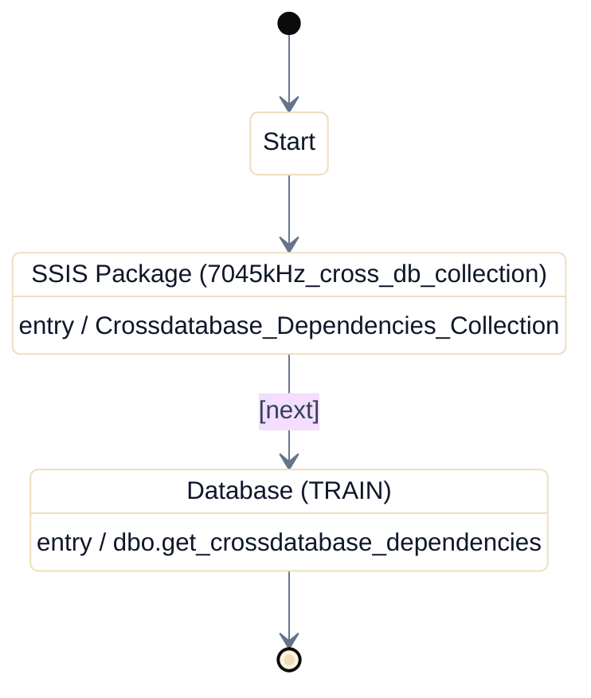

---

## 6. Entity-Relationship (ER) Diagram

### SVG Render
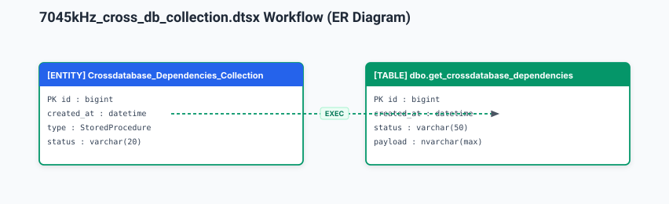

### Mermaid Definition
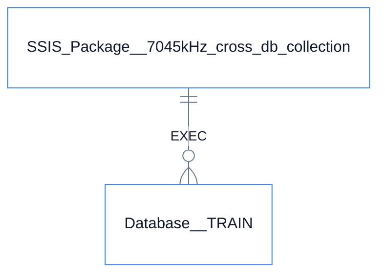

---

## 7. Artifact Summary

| Artifact | Format | Description |
| :--- | :--- | :--- |
| [`crossdatabase.svg`](crossdatabase.svg) | SVG | Vector top-down swimlane diagram |
| [`crossdatabase_lr.svg`](crossdatabase_lr.svg) | SVG | Vector horizontal swimlane diagram |
| [`crossdatabase_journey.svg`](crossdatabase_journey.svg) | SVG | Vector milestone journey diagram |
| [`crossdatabase_sequence.svg`](crossdatabase_sequence.svg) | SVG | Vector sequence call diagram |
| [`crossdatabase_state.svg`](crossdatabase_state.svg) | SVG | Vector state transition diagram |
| [`crossdatabase_er.svg`](crossdatabase_er.svg) | SVG | Vector entity relationship diagram |
| [`crossdatabase.mmd`](crossdatabase.mmd) | Mermaid | Modernized TD flowchart definition |
| [`crossdatabase_lr.mmd`](crossdatabase_lr.mmd) | Mermaid | Modernized LR flowchart definition |
| [`crossdatabase_journey.mmd`](crossdatabase_journey.mmd) | Mermaid | Modernized milestone journey definition |
| [`crossdatabase_sequence.mmd`](crossdatabase_sequence.mmd) | Mermaid | Modernized sequence diagram definition |
| [`crossdatabase_state.mmd`](crossdatabase_state.mmd) | Mermaid | Modernized state diagram definition |
| [`crossdatabase_er.mmd`](crossdatabase_er.mmd) | Mermaid | Modernized ER diagram definition |
| [`crossdatabase.xlsx`](crossdatabase.xlsx) | Excel | Microsoft Visio Process Model data workbook |
| [`crossdatabase.json`](crossdatabase.json) | JSON | Canonical Process Model specification |
